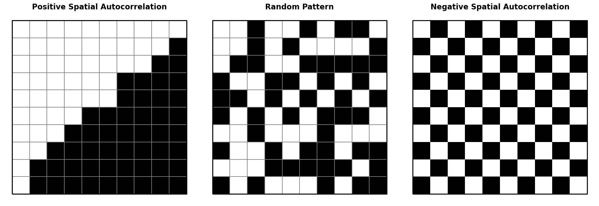
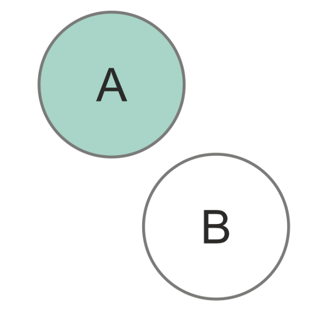
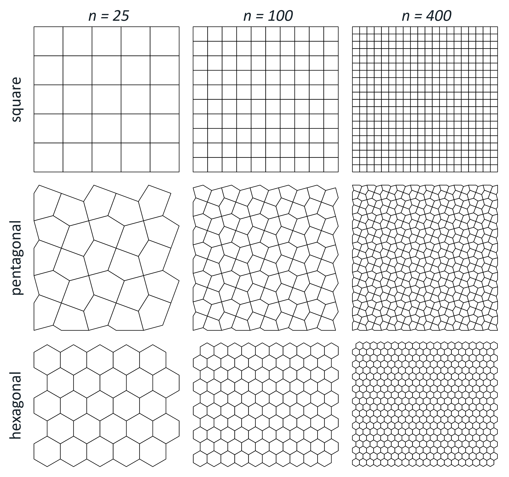
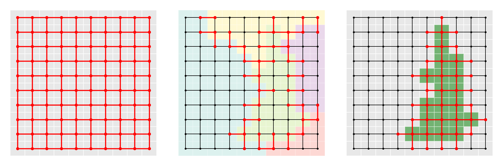
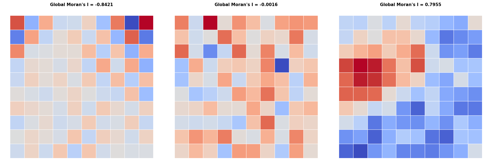

# Introduction

# Background

## Spatial statistics

<!--- The first appearance of formalizing spatial autocorrelation formula goes to @moran1950 known as Moran's I, most widely known spatial autocorrelation indicator. The next one was Geary with his Geary C. Spatial autocorrelation was popularized by the seminal work of cliff and ord, alongside spatial weight matrices, which are a part of spatial autocorrelation formulas. SAC is important part of analysis in many fields including physical geography, health sciences and epidemiology, criminology, segregation, political geogrphy and spatial econometrics among others. -->

### Spatial weights

Spatial weights, formalized by the seminal work by Cliff & Ord (1973), connect objects in geographic space using the spatial relationship between them. They serve for defining spatial neighbourhoods and geographically relevant sites. These relationships can be distance-based (k-nearest neigbours, distance bands), based on a membership in a geographic group (block weights) or adjacency-based (contiguity) among others. Each pair of observations is assigned a weight, which can either be boolean (1 for a spatial relationship, 0 otherwise), or specific numerical value (e. g. inverse distance). We will further focus on contiguity-based spatial weights, as those can be directly impacted by violating polygonal coverage.

Spatial weights can be represented as a matrix, denoted as $W$. $W$ is a $N \times N$ matrix, where $N$ is the number observations. Each element $w_{ij}$ corresponds to the weight between observations $i$ and $j$, that is, how much observation $j$ influences observation $i$. Because geographic datasets are rarely fully interconnected, most elements in $W$ are 0. To ensure computational and memory efficiency, tools like libpysal [@rey2022PySAL], geoda [@anselin2006GeoDa] or spdep [@spdep] also implement sparse matrix, which stores only non-zero elements.

-fig nejaky data, jejich spatial weight matrix, jejich graph

Spatial weight matrix can be understood as a graph adjacency matrix, therefore spatial graph is another representation of spatial weights. A weighted graph is defined as an ordered triple $G = (V,E,\omega)$, where $V$ is a set of nodes, $E$ is a set of edges representing connectivity between nodes and $\omega:E \to \mathbb{R}$ is a function that assigns real numbers (weights) to edges. Two nodes $i, j \in V$ are adjacent if there exists an edge $\{i, j\} \in E$ connecting them. Each node represents an observation and a weighted edge denotes the relationship between observations. Fundamentally, spatial weights matrices and graphs store the exact same topological information; the matrix is simply the algebraic representation of the spatial graph.

-neco o symetricnosti?

<!--- Fundamentally, spatial weights matrices and graphs store the exact same topological information; the matrix is simply the algebraic representation of the spatial graph. Computational libraries accommodate both structures and allow for conversion between them (@rey2022PySAL, @spdep). While the matrix is the standard for calculating spatial autocorrelation formulas (@moran1950, @geary) and other spatial statistics, the graph provides more intuitive framework for clustering, where operations like minimum spanning trees and graph partitioning are necessary (@AssuncaoSkater, @duque2012). --->

#### Contiguity {#sec-contiguity}

Spatial objects that share a common border are considered to be contiguous. However, "sharing a common border" isn't a rigorous definition, leading to several formal interpretations of contiguity. The primary types of contiguity are named analogically to the movements of chess pieces: *Rook*, *Queen*, and *Bishop*.

For a pair of polygons to be considered *Rook* neighbours, the polygons must share an edge (a boundary of non-zero length). *Queen* contiguity is less strict - the polygons are considered neighbours if they share at least one point (vertex or a shared edge). Bishop contiguity, rarely used on its own is strictly defined as polygons sharing only a point, but no edges. Therefore, it represents the logical difference between *Queen* and *Rook* contiguity (*Queen* - *Rook*). <!--- All of these relationships can be formally expressed using the DE-9IM strings, as illustrated in Figure XX. -->Furthermore, these base definitions can be expanded into higher-order contiguity weights (neighbours of neigbours) to model relationships beyond immediate neighbours.

-nejaky deeper popis contigutiy matrix? symetričnost, row standartization?

-In geographical analysis, Rook or Queen contiguity is usually the standard. There is no concensus, which matrices use when, it is mostly experimental as it depends on the character of the data, but it impacts the outcome of the statistic.. nejaka hlubsi resers na specfication of weight matrix?

<!---Euler in his Konigsberg bridges solution relied on the concept of a node degree - the number of edges incident to a given node, observing that the problem has a solution only if all the nodes (landmasses) have an even degree (are connected by an even number of bridges). --->

### Spatial autocorrelation

According to Tobler's Firts law of geography "everything is related to everything else, but near things are more related than distant things". This principle underlies the concept of spatial autocorrelation (SAC) - the degree to which the value of an observation resembles the values of its spatial neighbours. Under a positive SAC, observations that are geographically close have similar values and tend to cluster. Under a negative SAC, similar values tend to be spatially dispersed rather than clustered, resembling a checkerboard pattern.

{#fig-sac fig-align="center" width="80%"}

-spatial autocrrelation pozivame tehdy a tehdy

#### Moran's I

A useful visualization to built some intuition for SAC is the Moran scatterplot which visualizes the relationship between the value of each observation and the values of its neighbour - spatial lag. The spatial lag of observation $i$ is the weighted sum of the centered values of its neighbours, as defined by the spatial weights matrix $W$:

$$
y_{sl-i} = \sum_{j} w_{ij}y_j
$$ {#eq-lag}

where $w_{ij}$ is an element of $W$ capturing the spatial relationship between observations $i$ and $j$ and $y_j$ is the centered value of observation $j$. Common pratice is to row standartize $W$, so that the weights in each row sum to exactly one. Neighbours are most commonly defined using either Queen or Rook contiguity (see @sec-contiguity).

-fig moran scatter plot

On the Moran scatterplot, each observation is plotted with its centered value on the x-axis and its spatial lag on the y-axis. At the global level, the slope of the best-fit regression line through the scatterplot corresponds to the value of global Moran's I [@moran1950], the most widely used SAC statistic. It is defined as

$$
I = \frac{n}{\sum_i \sum_j w_{ij}} \frac{\sum_i \sum_j w_{ij} z_i z_j}{\sum_i z_i^2}
$$ {#eq-global_i}

where $n$ is the number of observations, $w_{ij}$ is an element of $W$ and $z_i$ and $z_j$ is the standartized values of observation $i$ and $j$.

The value of $I$ typically falls within the interval $[-1, 1]$. Values close to 1 indicate strong positive spatial autocorrelation, values close to -1 indicate strong negative spatial autocorrelation, and values close to 0 indicate a spatially random pattern.

At the local level, the four quadrants of the Moran scatterplot correspond to four characteristic spatial situations, distinguished by the signs of an observation's value and its spatial lag:

-   High-High (HH): an observation with an above-average value surrounded by neighbours with above-average values - a cluster of high values.

-   Low-Low (LL): an observation with a below-average value surrounded by neighbours with below-average values - a cluster of low values.

-   Low-High (LH): an observation with an above-average value surrounded by neighbours with below-average values - a high-value outlier within a low-value neighbourhood.

-   High-Low (HL): an observation with a below-average value surrounded by neighbours with above-average values - a low-value outlier within a high-value neighbourhood.

The quadrant to which an observation belongs can be read directly from the signs of its centered value and its spatial lag. This classification alone does not indicate whether the observation belongs to that category because of a genuine spatial pattern or by chance. To make this distinction, local indicators of spatial association (LISA) are used together with a test of statistical significance. The most commonly used local indicator is local Moran's I, defined as

$$
I_i = \frac{z_i}{m_2} \sum_{j} w_{ij}z_j \; ; \; m_2 = \frac{\sum_i z_i^2}{n}
$$ {#eq-local_i}

where $z_i$ and $z_j$ are centered values on observation $i$ and $j$, $w_{ij}$ is the spatial weight for a pair of observations $i$ and $j$ and $m_2$ is the second moment (variance). A positive value of $I_i$​ indicates that observation $i$ belongs to an HH or LL quadrant, whereas a negative value indicates that it belongs to an HL or LH quadrant.

Because a specific local Moran's I value can be obtained purely by chance, its statistical significance must be assessed before an observation is interpreted as belonging to a genuine cluster. Significance is typically expressed as a p-value under the null hypothesis that the attribute values are randomly distributed in space and carry no information about their surroundings. The p-value is commonly obtained through a permutation procedure, when the observed values are repeatedly reassigned at random to locations (usually 999 times, esda default), local Moran's I is recalculated for each permutation, and the p-value is given by the proportion of permutations producing a value as extreme as, or more extreme than, the observed one. An observation is conventionally considered a significant part of a spatial cluster if $p<0.05$ . In practice, results are often visualized as LISA cluster maps, in which only statistically significant HH, LL, HL, and LH clusters are highlighted, while non-significant observations are shown in grey.

-fig lisa cluster map

On LISA cluster maps of real-world data, the majority of significant clusters are typically HH or LL, compared to few HL or LH outliers, which is consistent with Tobler's first law of geography - similar values tend to occur near one another more often than not.

#### Geary C

Geary's C is another widely used measure of spatial autocorrelation. Its global form is given by

$$
C = \frac{(n - 1)}{2 \sum_i \sum_j w_{ij}} \frac{\sum_i \sum_j w_{ij} (y_i - y_j)^2}{\sum_i (y_i - \bar{y})^2}
$$ {#eq-global_c}

where $n$ is the number of observations, $w_{ij}$ is the spatial weight for a pair of observation $i$ and $j$, $y_i$ and $y_j$ are raw values of observations $i$ and $j$, respectively and $\bar{y}$ is the mean value of the whole dataset. Unlike Moran's I, which uses cross-products on the standartized values, Geary's C computes differences of raw values, which in case of very different neigbouring values, it inflates the $C$ value, making it more sensitive to appearance of local negative SAC. $C$ is bounded below by zero, which indicates strong positive SAC, values close to one indicate random spatial pattern, and any values markably larger than one indicate negative SAC.

The local version, Local Geary C, proposed by Anselin, is defined for each observation $i$ as:

$$
c_i = \sum_j w_{ij}(y_i - y_j)^2
$$ {#eq-local_c}

where $w_{ij}$ is the spatial weight for a pair of observation $i$ and $j$, $y_i$ and $y_j$ are raw values of observations $i$ and $j$,. High values of local $c_i$ highlight areas of abrupt changes in value. As with any LISA, the magnitude of $c_i$ is less important on its own than its statistical significance, which determines whether the identified local pattern is genuine.

#### Gettis Ord G

Proposed by @getis1992, the local $G$ is an indicator of positive spatial autocorrelation. It can be defined in two ways, $G_i$ excludes observation's $i$ own value, wheres $G_i^*$ includes it:

$$ G_i = \frac{\sum_{j \neq i} w_{ij} x_j}{\sum_{j \neq i} x_j},G_i^* = \frac{\sum_j w_{ij} x_j}{\sum_j x_j} $$ {#eq-local_g}

where $w_{ij}$ is the weight between observation $i$ and $j$. $G$ captures the overall degree of positive spatial autocorrelation, where high $G$ values are associated with hot spots (areas with homogenously high values) and low values are associated with cold spots (areas with homogenously low values).

Getis-Ord G is complementary to local Moran's I. Local Moran's I primarily distinguishes between spatial clusters (HH/LL) and spatial outliers (HL/LH), but a positive value of local Moran's I does not by itself reveal whether the underlying cluster consists of high or low values. $G$ is specifically designed to make this distinction, identifying whether a concentration of similar values forms a hot spot or a cold spot. However, because $G_i$ Gi​ and $G_i$​ are computed from sums of raw, non-negative attribute values rather than centered or standardized ones, they cannot detect negative spatial autocorrelation.

### Regionalization

Regionalization is the process of creating regions [@duque2007]. It is essentially grouping similar observations together, which we recognize as clustering, but with a spatial constraint that two observations (polygons) can be in the same cluster only if they share a border - contiguity. Regionalization is therefore known as spatially constrained clustering.

The objective of any clustering method is to minimize the dissimilarity within each cluster. The overall dissimilarity of a dataset is described with the sum of all pairwise distances $T$:

$$T = \frac{1}{2} \sum_{i=1}^{n} \sum_{j=1}^{n} d_{ij}$$ {#eq-reg_pairwise_dist}

where $d_{ij}$ is a measure of dissimilarity. $T$ consists of two complementary components: within-cluster dissimilarity $W$ and between-cluster dissimilarity $B$, which can be evaluated during the clustering (regionalization) process:

$$T=W+B$$ {#eq-sum_wb}

where

$$W = \frac{1}{2} \sum_{h=1}^{k} \sum_{i \in h} \sum_{j \in h} d_{ij}, \qquad B = \frac{1}{2} \sum_{h=1}^{k} \sum_{i \in h} \sum_{j \notin h} d_{ij}$$ {#eq-wb_explained}

$W$ acts as a loss function, the goal of clustering is to minimize it. Some methods explicitly use $W$ as the clustering criterion (e. g. SCHC using Ward's linkage) whereas other methods use different metrics to approximate the goal.

This chapter will serve as an overview of widely used methods and in the experimental part, we will test the robustness to polygonal coverage violations of two methods - SCHC and SKATER.

#### Agglomerative clustering/SCHC

Spatially constrained hierarchical clustering is a bottom-up approach, where each observation starts as its own cluster ($k=n$) and the clusters (or single observations) are being recursively merged based on their dissimilarity. Dissimilarity is computed based on definition of cluster distance in attribute space, referred to as linkage criterion. In vast majority of applications, dissimilarity is measured using Euclidean distance, which also required for the use of Ward's linkage, preferred for regionalization and will be further described in this chapter. Other common linkages include single linkage (minimum distance between any pair of observations in the two clusters), complete linkage (maximum distance), and average linkage (mean distance).

The dissimilarity is denoted in dissimilarity matrix $D$, which is initially $n \times n$ as each observation starts as its own cluster. Each element $d_{ij}$ represents the dissimilarity between each pair of clusters (or single observations). At each step, the algorithm merges the two clusters/observations, that have the smallest dissimilarity (smallest value from $D$) under the contiguity constraint. After each merge, $D$ is updated using an updating formula, that computes the dissimilarities between the new cluster $C$ and a cluster $P$, reducing both dimensions of $D$ by one in each iteration.

Ward's method, developed by @ward1963, explicitly minimizes the within-cluster dissimilarity (variance) defined trough the sum of squared errors ($WSS$). The input structure to use Ward's method is a $n \times p$ matrix $X$, where $n$ is the number of observations, $p$ is the number of variable and each element represents the (standartized) value of each variable for each observation. $WSS$ can be then formally defined as:

$$WSS = \sum_{i \in C} (x_i - \bar{x}_C)^2$$ {#eq-wss_schc}

where $x_i$ is a single row of $X$ (the vector of attributes for observation $i$) and $\bar{x}_C$ is the centroid of all observations in cluster $C$. Intuitively, the overall $WSS$ increases when we merge two clusters, so the goal at each step is to choose the merge that increases $WSS$ by the smallest possible amount. This turns out to be equivalent to merging the two clusters whose centroids are closest based on a dissimilarity matrix $D$. Ward's method expresses the dissimilarity trough the square of the Euclidean distance, therefore the dissimilarity between clusters is defined as

$$d^2_{AB} = \frac{2n_A n_B}{n_A + n_B} \| \bar{x}_A - \bar{x}_B \|^2$$ {#eq-dissimilarity}

After two clusters $A$ and $B$ are merged into a new cluster $C$, the dissimilarities between $C$ and every other cluster $P$ can be computed without recalculating centroids, using the Lance-Williams updating formula:

$$d^2_{PC} = \frac{n_A + n_P}{n_C + n_P} d^2_{PA} + \frac{n_B + n_P}{n_C + n_P} d^2_{PB} - \frac{n_P}{n_C + n_P} d^2_{AB}$$ {#eq-dissimilarity-updating}

As mentioned above, the clusters/observations can be only merged under the contiguity constraint, which is denoted in spatial weights matrix $W$. For this thesis, we will assume a binary $W$, meaning that observations $i$ and $j$ can be merged only if $w_{ij}-1$. After the merge, $W$ needs to be updated. If $i$ and $j$ were merged into a new cluster $C$, $i$-th and $j$-th row and column will be replaced by $C$. The relationship between $C$ and the rest of the clusters $P$ will be set to $w_{PC}= 1$ if $w_{iP}=1 \lor w_{jP}=1$, inheriting all the neighbours of both $i$ and $j$.

In practice, the number of clusters (regions) $k$ is fixed in advance, and the merging process stops once this number is reached. This corresponds to "cutting" the hierarchical tree, or dendrogram, at the appropriate height.

-fig dendrogram

-definovany jen pro 1 componentu?

-nevratny/greedy algorithm

#### SKATER

Spatial 'K'luster Analysis by Tree Edge Removal (SKATER), developed by @AssuncaoSkater, is another hierarchical regionalization method. Unlike SCHC, it is not agglomerative, but divisive. It is based on pruning a minimum spanning tree (MST) - a subgraph that connects all nodes of a graph using the subset of edges with the minimum possible total edge weight, without forming any cycles.

For SKATER, MST is a subset of edges from contiguity spatial weights graph (see definiton in @sec-contiguity). The weights are assigned to each $(i,j)$ edge based on the dissimilarity between the attribute vectors of observations $i$ and $j$, typically their squared Euclidean distance in attribute space:

$$d(i, j) = d(x_i, x_j) = \sum_{l=1}^{n} (\mathbf{x}_{il} - \mathbf{x}_{jl})^2$$ {#eq-euclidean_distance_skater}

where $x_i$, $x_j$ are attribute vectors of observations $i$ and $j$.

The initial MST has exactly $n-1$ edges. All observations are considered to be in one region. The MST is pruned by removing an edge which increases the between-cluster dissimilarity the most. This is accessed trough calculating the sum of squared devations (SSD) calculated as

$$SSD_T = \sum_{i \in T} (x_i - \bar{x}_T)^2$$

where $\bar{x}_T$ is the centroid of the attribute values of all observations in $T$. Removing an edge splits a tree $T$ into two subtrees $A$ and $B$. The resulting reduction in within-cluster dissimilarity is given by

$$\Delta SSD=SSD_T-(SSD_A+SSD_B)$$ {#eq-ssd_skater}

At each step, SKATER removes the edge that maximizes $\Delta SSD$, i.e. the split that most reduces the combined within-cluster dissimilarity of the two resulting subtrees. This process is repeated, recursively splitting the resulting subtrees, until the desired number of regions $k$ is reached.

-jeste neni konec

#### AZP

#### REDCAP

#### Max p-regions

## Topology in geography

Topology is a mathematical discipline that “studies properties of spaces that are invariant to continuous deformation” [@waterloo_topology]. In geographic context, it means focusing strictly on the spatial relationships between features, such as connectivity, adjacency, and containment (citace), rather than their absolute geometric shape, distance, or magnitude.

Topological relationships are essential in numerous geographical disciplines, such as landscape ecology using overlay analysis, hydrology, geography of transport using the network analysis/line adjacency, cartography and spatial statistics (topologies of borders) [@papadimitriou_geo-topology_2023]. Probably one the most important connections between topology and geography is the Four Colour Theorem, proposed by Francis Guthrie 1852. It states that any planar map consisting of polygons can be coloured using only four colours without any pair of neigbouring polygons sharing the same colour. The theorem was proven more than a hundred years later by @appel1977fourcolor1 and it relied entirely on topological principles, specifically, polygonal adjacency.

<!-- The discipline was formally established in the early 20th century, however its roots trace back to Leonhard Euler’s solution to the Seven Bridges of Königsberg problem (@euler1741solutio). The objective of the problem was to cross every bridge in the city exactly once and return to the starting point. The physical distances and exact shapes of the landmasses were entirely irrelevant to the solution, the outcome depended solely on knowing which bridges connected which landmasses. By abstracting the city into a graph (see definition in chap. xx) while preserving the information about the connectivity of the landmasses, he was able to solve the problem. --->

The formal study topological relationships is rooted in point-set topology, also known as general topology, as it is the foundation to many other related disciplines. It relies on the concepts set theory, introduced by @cantor1874, like set operations (e. g. intersection, union, complement), as well as the fundamental notions of subsets, open sets, and neighborhoods. Furthermore, point-set topology concepts like interior, boundary and exterior, introduced by @hausdorff1914grundzuge, are the foundation for topological models, used in modern GIS to formalize topological relationships.

This chapter shall explore..

\<!--

A topological space is a pair $(X, \tau)$, where $X$ is a set of points and $\tau$ is a collection of subsets of $X$ (the topology). $\tau$ must satisfy the following axioms:

1.  Any union of elements of $\tau$ belongs to $\tau$.
2.  Any finite intersection of elements of $\tau$ belongs to $\tau$.
3.  $X$ and $\emptyset$ belong to $\tau$.

Based on the definition of topological space, @hausdorff1914grundzuge formally defined the interior, boundary and exterior of a set. These three topological properties are the core of topological models used in spatial analysis. Given a set $Y$ in topological space $(X, tau)$:

-   interior (doplnim)

-   boundary

-   exterior --\>

-   tohle ma byt zakomentovany ale nejde mi to

<!--This phenomena is used across other fields. Among the most notable applications of graphs on topological relationships, Kirchhoff (1847) represented an electrical circuit as a graph, implicitly using tree structures (see chapter xx) to identify independent circuit equations. A tree in the context of graph theory was later formalized by Cayley (1857), who used graphs to represent chemical structures.-->

### Topological models

During the 1980s, terms for spatial relations were mentioned in literature, however, they lacked formal definitions and were mostly treated as axiomatic [@egenhoferPointsetTopologicalSpatial1991]. The first rigorous framework for topological relationships was the *4-Intersection Model* (*4-IM*) developed by @egenhoferPointsetTopologicalSpatial1991. It applied interior and boundary definitions from point set topology to a geospatial context. The *4-IM* served as the predecessor to the *Dimensionally Extended 9-Intersection Model* (*DE9-IM*) [@clementiniSmallSetFormal1993], which is now the standard adopted by the *Open Geospatial Consorcium* (*OGC*). Expanding the *4-IM*, it is based on a 3×3 matrix of all possible intersections between interior, boundary and exterior of two geometries (point, line or polygon) and further describes the dimension of those intersections:

$$\text{DE-9IM}(a,b) = \begin{bmatrix} \dim(a^\circ \cap b^\circ) & \dim(a^\circ \cap \partial b) & \dim(a^\circ \cap b^-) \\ \dim(\partial a \cap b^\circ) & \dim(\partial a \cap \partial b) & \dim(\partial a \cap b^-) \\ \dim(a^- \cap b^\circ) & \dim(a^- \cap \partial b) & \dim(a^- \cap b^-) \end{bmatrix}$$ {#eq-de9im}

where...

-   False (-1) if there is no intersection,
-   0 if the intersection is a point,
-   1 if the intersection is a line,
-   2 if the intersection is a polygon.

In most use cases, non-empty intersections (0, 1 or 2) can be universally treated as $True$ when the result is invariant to the intersection dimension. However, for defining contiguities the dimension of the intersection is required as discussed in @sec-contiguity. Specific value combinations in the matrix have standard names, which are referred to as spatial predicates. The *C++* library *GEOS* - a core dependency of many libraries (e. g. *Shapely*, *Geopandas*), databases (e. g. *PostGIS*), and applications (e. g. *QGIS*) - recognizes 9 spatial predicates (see @tab-spatial_predicates) @geos. For computational purposes, the matrix is often flattened into a 9-character DE-9IM string.

+-------------------+-------------------+-------------+----------------------------------------+
| Spatial predicate | DE-9IM string     | Description | Illustration?                          |
+:=================:+===================+=============+========================================+
| Intersects        | ??                |             |                                        |
+-------------------+-------------------+-------------+----------------------------------------+
| Touches           | FT\*\*\*\*\*\*\*\ |             |                                        |
|                   | F\*\*T\*\*\*\*\*\ |             |                                        |
|                   | F\*\*\*T\*\*\*\*  |             |                                        |
+-------------------+-------------------+-------------+----------------------------------------+
| Disjoint          | FF\*FF\*\*\*\*    |             | {width="30%"} |
+-------------------+-------------------+-------------+----------------------------------------+
| Crosses           | T\*T\*\*\*\*\*\*\ |             |                                        |
|                   | 0\*\*\*\*\*\*\*\* |             |                                        |
+-------------------+-------------------+-------------+----------------------------------------+
| Within            | T\*F\*\*F\*\*\*   |             |                                        |
+-------------------+-------------------+-------------+----------------------------------------+
| Contains          | ??                |             |                                        |
+-------------------+-------------------+-------------+----------------------------------------+
| Overlaps          | T\*T\*\*\*T\*\*   |             |                                        |
+-------------------+-------------------+-------------+----------------------------------------+
| Equals            | TFFFTFFFT         |             |                                        |
+-------------------+-------------------+-------------+----------------------------------------+
| Covers            | ??                |             |                                        |
+-------------------+-------------------+-------------+----------------------------------------+

: Spatial predicates. - tohle taky dopnim

Software libraries implement these predicates alongside additional ones as boolean functions, such as modified formulations (e. g. `contains_properly` in *Shapely* library) or inverse relationships (e. g. `covered_by` in *Shapely*). Custom spatial queries can be formalized by defining the flattened DE9-IM string (e. g. `relate` in *Shapely*, `ST_relate` in *PostGIS*). Topological relationships derived from *DE-9IM* are the underlying framework for many spatial operations including overlay analysis, contiguity detection, and topology validation.

### Topological validity and polygonal coverage

Spatial data often suffers from errors from a variety of sources. These inaccuracies are typically introduced during manual vectorization or data entry, data transfer, geometric editing operations (such as simplification or reprojection), or the integration of heterogeneous datasets of varying ages [@spatialeye_topology, @gisgeography_topology, @servigne2000].

@servigne2000 categorizes spatial consistency errors into three primary types:

-   **Structural errors:** Arising when the chosen data structure cannot adequately accommodate the data model.
-   **Geometric errors:** Conceptually invalid geometry (e. g. self-intersecting polygons).
-   **Topo-semantic errors:** Occurring when the geometric representation violates real-world logical constraints (e.g., a single building footprint incorrectly intersecting two distinct parcels).

Geometric and topo-semantic errors are particularly problematic when detecting topological relationships, as they are not immediately noticable. The most commonly used data structures in modern GIS are "spaghetti" models (e.g., GeoJSON, Shapefile, Parquet, and GeoPackage). These models store each geometry as an isolated record with no information about their mutual relationships, therefore they need to be derived from the geometry (vertices). In presence of geometrical inaccuracies, accurate detection of topological relationships is impossible.

According to @ubedaTopologicalErrorCorrecting1997a, the topology error correction process consists of three steps: definition, checking, and correction. Definitions of the errors is esentially establishing the spatial constraints input data must satisfy. These user-defined constraints are derived from formal spatial predicates. Many of these rules are explicitely implemented as ready-to-use topology checkers in desktop GIS software like *QGIS* and *ArcGIS Pro* (e. g. `must not have dangles` for line features, `must not overlap` for line or polygonal features).

Polygonal coverage, or also planar enforcement, is a specific case of these rules. It is a strict requirement for contiguity detection @rey2022PySAL. Valid polygonal coverage requires specific set of topological constraints, which it must satisfy @jtsLinearThinkingPolygonal2022:

-   polygon interiors must not overlap (no slivers),
-   a shared boundary between polygons must have the same set of vertices (no gaps).

-fig topology errors slivers, gaps

Geoplanar also adresses these non-planar touches and edges as planar enforcement violation as in their presence, contiguity detection is compromised. For Rook contiguity, two polygons are considered a neighbour if they share at least two consecutive vertices. These vertices need to be present and encoded in both polygons, which differs from a pure spatial predicate testing overlapping boundaries, as this might not be encoded as two consecutive vertices in one of the neighbours if the shared part is just a slice of an edge. Similarly with Queen contiguity - two polygons are considered a neighbour if they share a vertex. While some tools (e.g. libpysal) allow both of these definitions, a default is the strict vertex coincidence - a potential point of topology corruption in real-world data.

-fig non planar touches/edges

<!-- Various software tools can evaluate the datasets for topology violations. Shapely, python wrapper for the GEOS library, implements functions for checking individual geometric validity rather than global topology. JTS Topology Suite (JTS), an open source Java software library, can evaluate an entire polygonal coverage, returning error strings with the specific coordinates of violations. Desktop software like QGIS and ArcGIS Pro evaluate the selected topology rules (i. e. for polygonal coverage must not overlap and must not have gaps) and visually highlight every error on the map. While JTS, QGIS, and ArcGIS Pro validate topology by checking individual geometries, Mapshaper temporarily converts the spaghetti model into an explicit topological data structure. Instead of storing independent geometries in rows, Mapshaper decomposes a polygonal dataset into an arc-node graph: creating edges (arcs) for boundaries and nodes where three or more polygons intersect. Polygons are then defined mathematically through sequences of these shared arcs, eliminating coordinate redundancy. In this explicit topological structure, the information detailing which polygons neighbor each other is inherently stored within the data model itself. -->

-identifying a Fixing errors, jts, geoplanar + neco malo qgis/arcgis a mapshaper

-fuzzy contiguity

-diagram pro premka

-even though such tools exist, topological errors still occur, a presne proto pisu tuhle praci

## Research gap

# Methodology

## Grid generation

To test robustness of spatial statistics under supervised conditions, three lattice geometries were considered - square, pentagonal (A5) and hexagonal (H3). Lattice geometry influences the number of average number of neigbours per observation. All three geometries were generated in three different dataset sizes - $n=25$ (5×5 grid), $n=100$ (10×10 grid), and $n=400$ (20×20 grid).

{#fig-structures fig-align="center" width="60%"}

## Synthetic region delineation

Regions were predefined on all three geometries at two dataset sizes: $n=100$ and $n=400$, giving six spatial configurations in total. For each spatial configuration, five polygons were randomly selected as seeds, which grow into spatially connected regions, folowing the procedure of @guo2023. The process was repeated 10 times per configuration, producing 10 distinct zonations. The minimum region size was set to 12 polygons for $n = 100$ and 48 polygons for $n = 400$. These zonations are utilized in contiguity corruption parametrization and they provide the basis for generating synthetic attribute data for the regionalization experiment.

## Contiguity corruption

To simulate the effect of topological errors on spatial analysis, a controlled procedure for corrupting the Rook contiguity spatial weights matrix $W$ was developed. Starting from a topologically valid graph, edges (i.e., adjacency relationships between polygons) are iteratively removed to progressively degrade the spatial neighbourhood structure. Missing adjacencies are distributed spatially according to three distinct patterns:

-   **Randomly:** Edges are removed uniformly at random across the entire graph, representing spatially unpatterned errors with no particular spatial structure.
-   **Region borders:** Only edges crossing the boundary between two predefined regions can be removed, simulating errors arising from the integration of independently digitised datasets.
-   **Local:** Edges within or immediately adjacent to a single predefined region are targeted, representing localised digitisation or editing errors.

{#fig-cor_method fig-align="center" width="80%"}

Since spatial autocorrelation measures aren't explicitely defined for observations with no neighbours (isolates), their occurence has to be prevented while corrupting $W$. If at least one of two observations connected by an edge has a node degree of 1 (has only 1 neigbour), the edge is not eligible for removal. Similarly, regionalization algorithms require a single connected component, edges whose removal would disconnect the graph, referred to as bridges, cannot be removed.

-maximally corrupted graph no isolates/mst

At each iteration, the set of removable edges is computed as the intersection of the method-eligible and constraint-eligible subgraphs. One edge is removed, the constraint set is recomputed, and the process repeats until no further deletions are possible. From this sequence, 19 graphs were selected to represent a linear progression of missing edges, culminating in the maximally corrupted graph. Each sequence is repeated 10 times, yielding 190 corrupted graphs per corruption method. For the region borders and local corruption methods, each of the 10 repetitions is paired with a distinct zonation.

To avoid circularity in the regionalization evaluation, any corrupted graph derived from a given zonation is excluded from experiments if the input data were generated based on the same zonation.

## Spatial autocorrelation workflow

### Synthetic data

Attribute values were generated through a pure spatial autoregressive (SAR) process, following the procedure in @floraxImpactsMisspecifiedSpatial1995:

$$y=(I-\rho W)^{-1} \epsilon$$

where $y$ is the resulting vector of generated attribute values, $I$ is a identity matrix, $\rho$ is the spatial autoregressive parameter, $W$ is row-standartized Rook contiguity spatial weight matrix derived from each spatial configuration and $\epsilon$ is random normal error vector. The parameter $\rho$ was varied from -0.9 to 0.9 in increments of 0.1, with 10 independent draws of $\epsilon$ per value of $\rho$. This produced 190 unique value datasets per spatial configuration representing a wide spectrum differently spatially autocorrelated datasets (see examples in @fig-sar_examples).

{#fig-sar_examples fig-align="center" width="80%"}

### Real data

### Computation

### Evaluation

## Regionalization workflow

### Synthetic data

Tgenerated to exhibit strict stratified heterogeneity, meaning that true regression coefficients are constant within each predefined region but differ across regions. The underlying data-generating process follows a simple linear regression model used in @guo2023:

$$y = \beta_0 + \beta_1 x_1 + \beta_2 x_2 + \epsilon$$

where $x_1, x_2 \sim \mathcal{U}[0, 1)$ are independent covariates drawn i.i.d. from a uniform distribution, $\epsilon \sim \mathcal{N}(0, \sigma^2)$ is a random error term with $\sigma = 0.1$, and $\beta_0$, $\beta_1$, $\beta_2$ are region-specific regression coefficients. Within each of the five predefined regions, $\beta_1$ and $\beta_2$ take distinct values drawn from $\{-2, -1, 0, 1, 2\}$, while $\beta_0 = 0$ in all regions.

For each zonation, five independent sets of attribute values were generated following this process and subsequently used as input to the regionalization algorithms.

### Real data

### Computation

### Evaluation