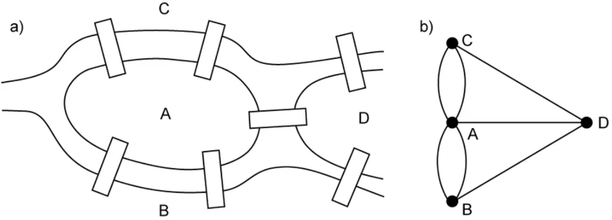
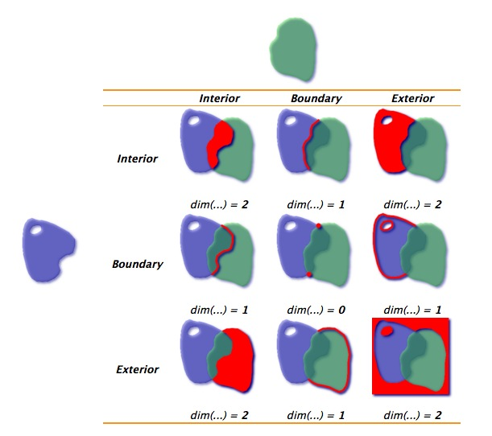
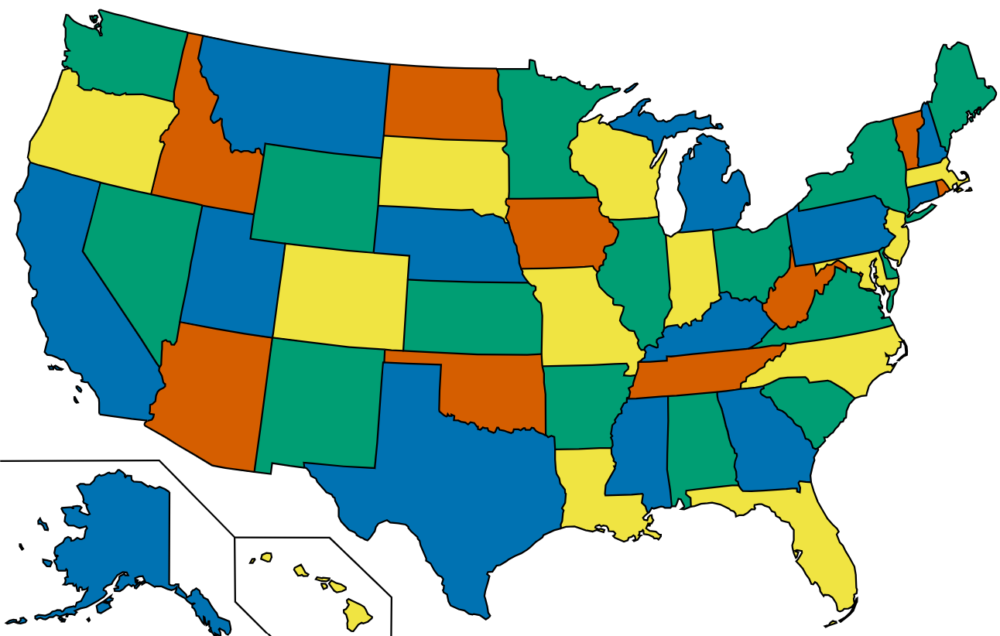

# Úvod

Úvod je tady.

Ukázková stránka:

\lipsum[2]

Citace vypadají takto [@Willimetz2025] a odkazy na objekty jako například @fig-priklad, @tbl-priklad nebo @eq-priklad. Pro přidání odkazů přidejte BibTeX záznamy do souboru `reference.bib`.

Pro zápis chemických vzorců použijte LaTeX příkaz `\ce`, například \ce{H2SO4}.

{#fig-priklad width="30%"}

Ukázková rovnice:

$$
c^2 = a^2 + b^2
$$ {#eq-priklad}

Ukázková tabulka:

|   A |   B |
|----:|----:|
|   1 |   4 |
|   2 |   5 |
|   3 |   6 |

: Ukázkový popis {#tbl-priklad}

# Background

## Topology in geography

Topology is a field of mathematics which “studies properties of spaces that are invariant to continuous deformation” @waterloo_topology. It takes into account relationships between objects rather than their shape or magnitude. The discipline was formalized at the beginning of 20th century, however, its roots go back to Euler's solution on Bridges of Konigsberg problem @euler1741solutio. The objective is to cross every bridge exactly once and return to the starting point. He abstracted the problem, as he represented the 4 landmasses as nodes and the 7 bridges as edges. In doing so, he laid the foundations for graph theory (see Chapter. xx), as he used a graph to represent topological relationships.

{#fig-konigsberg fig-align="center" width="80%"}

Topology in geographical context, geospatial topology or geotopology, refers to spatial relationships between geometries. The formal study of these relationships is rooted in point-set topology, also known as general topology, as it is the foundation to many other related disciplines. It relies on the concepts set theory, introduced by Georg Cantor (?), like set operations (e. g. intersection, union, complement), as well as the fundamental notions of subsets, open sets, and neighborhoods. @hausdorff1914grundzuge formalized topological space (see @def-topological-space) in his book on set theory, introducing the foundations of point-set topology.

::: {#def-topological-space style="border: 1px solid #333; padding: 1em;"}
## Topological space

A topological space is a pair $(X, \tau)$, where $X$ is a set of points and $\tau$ is a collection of subsets of $X$ (the topology). $\tau$ must satisfy the following axioms:

1.  Any union of elements of $\tau$ belongs to $\tau$.
2.  Any finite intersection of elements of $\tau$ belongs to $\tau$.
3.  $X$ and $\emptyset$ belong to $\tau$.
:::

Based on the definition of topological space, Hausdorff formally defined the interior, boundary and exterior of a set. These three topological properties are the core of topological models used in spatial analysis.

::: {#def-topo_parts}
## Interior, boundary, exterior

Given a set Y in topological space (X, tau):

-   interior
-   boundary
-   exterior
:::

Identifying these relationships is essential in numerous geographical disciplines, such as landscape ecology, hydrology, geography of transport, cartography and spatial statistics (@papadimitriou_geo-topology_2023).

### Topological models

During the 1980s, terms for spatial relations were mentioned in literature, however, they lacked formal definitions and were mostly treated as axiomatic (@egenhoferPointsetTopologicalSpatial1991). The first rigorous framework for topological relationships was the 4-Intersection Model (4-IM) developed by @egenhoferPointsetTopologicalSpatial1991. It applied interior and boundary definitions from point set topology to a geospatial context. The 4-IM served as the predecessor to the Dimensionally Extended 9-Intersection Model (DE9-IM) (@clementiniSmallSetFormal1993), which is now the standard adopted by the Open Geospatial Consorcium (OGC). Expanding the 4-IM, it is based on a 3×3 matrix of all possible intersections between interior, boundary and exterior of two geometries (point, line or polygon) and further describes the dimension of those intersections:

-   False (-1) if there is no intersection,
-   0 if the intersection is a point,
-   1 if the intersection is a line,
-   2 if the intersection is a polygon.

{#fig-de9im fig-align="center" width="80%"}

In most use cases, non-empty intersections (0,1 or 2) can be universally treated as True when the result is invariant to the intersection dimension, however, for defining contiguities the dimension of the intersection is required (see chapt. xx). Specific value combinations in the matrix have standard names, which are referred to as spatial predicates. The C++ library GEOS - a core dependency of many libraries (e. g. Shapely, Geopandas), databases (e. g. PostGIS), and applications (e. g. QGIS) - recognizes 9 spatial predicates (see tab @tab-spatial_predicates) @geos. For computational purposes, the matrix is often flattened into a 9-character DE-9IM string. <!--- ogc ma actually jen 8 predicates (excludes covers, je to postgis extention), pak mozna zminit relate a reverse funkce jako covered by nebo contains properly --->

+-------------------+-------------------+-------------+----------------------------------------+
| Spatial predicate | DE-9IM string     | Description | Illustration?                          |
+:=================:+===================+=============+========================================+
| Intersects        | ??                |             |                                        |
+-------------------+-------------------+-------------+----------------------------------------+
| Touches           | FT\*\*\*\*\*\*\*\ |             |                                        |
|                   | F\*\*T\*\*\*\*\*\ |             |                                        |
|                   | F\*\*\*T\*\*\*\*  |             |                                        |
+-------------------+-------------------+-------------+----------------------------------------+
| Disjoint          | FF\*FF\*\*\*\*    |             | {width="30%"} |
+-------------------+-------------------+-------------+----------------------------------------+
| Crosses           | T\*T\*\*\*\*\*\*\ |             |                                        |
|                   | 0\*\*\*\*\*\*\*\* |             |                                        |
+-------------------+-------------------+-------------+----------------------------------------+
| Within            | T\*F\*\*F\*\*\*   |             |                                        |
+-------------------+-------------------+-------------+----------------------------------------+
| Contains          | ??                |             |                                        |
+-------------------+-------------------+-------------+----------------------------------------+
| Overlaps          | T\*T\*\*\*T\*\*   |             |                                        |
+-------------------+-------------------+-------------+----------------------------------------+
| Equals            | TFFFTFFFT         |             |                                        |
+-------------------+-------------------+-------------+----------------------------------------+
| Covers            | ??                |             |                                        |
+-------------------+-------------------+-------------+----------------------------------------+

: Spatial predicates.

bridge na topological validity?

## Topological validity and polygonal coverage

Spatial data often consists of errors due to positional accuracy, digitizing error, geometry simplification, age of the data @gisgeography_topology, editing operations or integration of different datasets @spatialeye_topology.

## Contiguity

In 1852, Francis Guthrie introduced the Four Colour Problem. It asks whether a map in a plane can be coloured by no more than four colours without two neighbouring regions sharing the same colour. This was one of the foundational topological problems in geography as it only requires the information about the polygon neighbourhoods - contiguity. This concept is essential in many spatial analysis tools, including spatial autocorrelation and regionalization (see chapters xx).

{#fig-4color fig-align="center" width="80%"}

Contiguity refers to boundary connectedness @esri_contiguity. It is a formal way of defining polygon neigbourhood. Boundary connectedness is rather an unprecise... , therefore there are 3 main types of contiguity: Queen, Rook and Bishop, named by chess characters based on their ability to move across a chessboard.

When using Queen contiguity to define polygon neighbourhoods, two polygons are adjacent if their boundaries share at least one point. This relationship is identical to the “touches” spatial predicate (see Chap. xx). Rook contiguity is stricter - boundaries of two polygons must share a line. The not so commonly used contiguity, Bishop, identifies two polygons as adjacent only if their boundaries share a point, but not when they share a line. These contiguities can be rigorously defined through DE-9IM matrices or strings (see Tab. xx).

| Contiguity | DE-9IM string    | Col3 |
|------------|------------------|------|
| Queen      |                  |      |
| Rook       | F\*\*\*1\*\*\*\* |      |
| Bishop     |                  |      |

Contiguity alongside with its derivatives (e. g. 2nd order Queen contiguity including neigbours of neighbours) is not the only way how to define

Fuzzy contiguity

tady bude diagram pro premka

Spatial graph

A graph is defined as an ordered pair G = (V,E), where V is a set of nodes and E is a set of edges representing connectivity between nodes. A node v V is incident to an edge e E if v is an endpoint of that edge. Two nodes i, j V are adjacent if there exists an edge {i, j} E connecting them. A graph can either be undirected, where edges have no orientation and {i,j} = {j,i}, or directed, where each edge can be assigned a direction (one-way or both), therefore (i,j) (j,i).

Euler in his Konigsberg bridges solution relied on the concept of a node degree - the number of edges incident to a given node, observing that the problem has a solution only if all the nodes (landmasses) have an even degree (are connected by an even number of bridges).

Among the most notable applications of graphs on topological relationships, Kirchhoff (1847) represented an electrical circuit as a graph, implicitly using tree structures (see chapter xx) to identify independent circuit equations. A tree in the context of graph theory was later formalized by Cayley (1857), who used graphs to represent chemical structures. However, it is important to note that not all topological relationships can be represented as graphs and that not all graphs represent topological relationships.

### Spatial weight matrix

# Výsledky

Výsledky jsou tady.

## Podkapitola

Text podkapitoly je tady.

### Podpodkapitola

Text podpodkapitoly je tady.

# Diskuze

Diskuze je tady.

# Závěr

Závěr je tady.