# Introduction

Modelling of spatial phenomena has always been central to geoinformatics and geographical information science, to the extent that spatial statistics is considered an integral part of the discipline [@goodchild1992]...

# Background

## Spatial statistics

Spatial statistics concerns itself with the quantitative analysis and modelling of spatial data [@pilz2025], drawing its foundations from probability theory, mathematical statistics, and stochastic modelling. Its methods address statistical dependencies between observations, spatial heterogeneity, and uncertainty inherent to geographic data - using techniques such as spatial autocorrelation analysis, clustering, interpolation or spatial modelling among others [@ripley1981; @handbook2010].

A common prerequisite to these methods is a mathematically formalized representation of the relationships between spatial observations. Such relationships are encoded through spatial weights, which define the neighbourhood structure of the data and govern how influence is propagated across space.

This subchapter provides an overview of the core spatial statistical methods employed in the subsequent analysis. It first introduces spatial weights with a focus on contiguity definitions, then presents the most established spatial autocorrelation techniques used to detect homogeneity and heterogeneity in spatial data. Finally, it discusses widely used regionalization methods, which seek to partition spatial units into coherent regions according to attribute similarity and spatial contiguity constraints.

<!--- The first appearance of formalizing spatial autocorrelation formula goes to @moran1950 known as Moran's I, most widely known spatial autocorrelation indicator. The next one was Geary with his Geary C. Spatial autocorrelation was popularized by the seminal work of cliff and ord, alongside spatial weight matrices, which are a part of spatial autocorrelation formulas. SAC is important part of analysis in many fields including physical geography, health sciences and epidemiology, criminology, segregation, political geogrphy and spatial econometrics among others. -->

### Spatial weights

Spatial weights, formalized by the seminal work by @cliff1973spatial, connect objects in geographic space using the spatial relationship between them. They serve for defining spatial neighbourhoods and geographically relevant sites. These relationships can be distance-based (k-nearest neigbours, distance bands), based on a membership in a geographic group (block weights) or adjacency-based (contiguity) among others [@reyGeographicDataScience2023]. Each pair of observations is assigned a weight, which can either be boolean (1 for a spatial relationship, 0 otherwise), or specific numerical value (e. g. inverse distance). We will further focus on contiguity-based spatial weights, as those can be directly impacted by violating polygonal coverage.

Spatial dependence is typically encoded in a spatial weights matrix $W$, an $N \times N$ matrix where $N$ denotes the number of observations [@reyGeographicDataScience2023]. Each element $w_{ij}$ corresponds to the weight between observations $i$ and $j$, that is, how much observation $j$ influences observation $i$. Because geographic datasets are rarely fully interconnected, most elements in $W$ are 0. To ensure computational and memory efficiency, tools like libpysal [@rey2010], geoda [@anselin2006GeoDa] or spdep [@spdep] implement sparse matrix, which stores only non-zero elements.

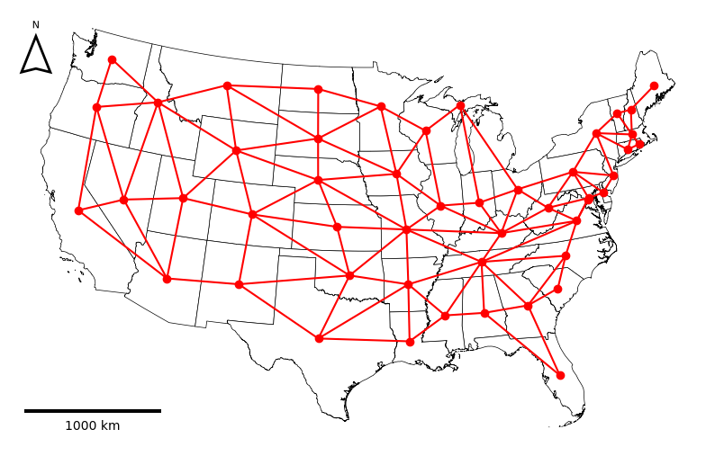{#fig-usa_graph fig-align="center" width="80%"}

Spatial weight matrix can be understood as a graph adjacency matrix, therefore spatial graph (see @fig-usa_graph) is another representation of spatial weights. A weighted graph is defined as an ordered triple $G = (V,E,\omega)$, where $V$ is a set of nodes, $E$ is a set of edges representing connectivity between nodes and $\omega:E \to \mathbb{R}$ is a function that assigns real numbers (weights) to edges. Two nodes $i, j \in V$ are adjacent if there exists an edge $\{i, j\} \in E$ connecting them. Each node represents an observation and a weighted edge denotes the relationship between observations. Fundamentally, spatial weights matrices and graphs store the exact same topological information; the matrix is simply the algebraic representation of the spatial graph.

#### Contiguity {#sec-contiguity}

Spatial weight matrices of geographic polygonal data are commonly defined trough contiguity [@anselin2014], meaning that polygons that share a mutual border are considered to be spatial neigbours. However, this definiton isn't rigorous, leading to several formal interpretations of contiguity. The correct detection heavily relies on topological consistency of the polygonal dataset. The primary types of contiguity are named analogically to the movements of chess pieces:

-   *Rook*: The polygons are considered neighbours if they share an edge (a boundary of non-zero length).

-   *Queen*: The polygons are considered neighbours if they share at least one point (vertex or a shared edge).

-   *Bishop*: The polygons are considered neighbours if they share only a point, but no edges. It represents the logical difference between *Queen* and *Rook* contiguity (*Queen* - *Rook).*

Rook and Queen contiguity matrices dominate in spatial statistics as they are the only valid choice for regionalization methods [@anselin2024] and are the default for spatial autocorrelation metrics [@cliff1973spatial]. Bishop is rarely used on its own, but sometimes it is used for hybrid weights, which combine more spatial operations to define neighbourhoods [@reyGeographicDataScience2023].

Beyond immediate neighbours, contiguity can be expanded to higher order contiguity weights (neigbours of neigbours), often used in spatial data modelling....

Contiguity weights are symmetric by construction, i.e. $w_{ij} = w_{ji}$, so that the corresponding graph can be considered undirected [@cliff1973spatial]. However, in practice, it is common to row-standardize $W$ so that each row sums to one, which breaks the symmetry as it turns $w_{ij}$ into the share of $i$'s total connectivity attributable to $j$. Row-standardization is the default for most spatial autocorrelation coefficients and spatial econometric models [@anselin1988; @lesage2009; @anselin2014].

### Spatial autocorrelation

According to Tobler's Firsts law of geography "everything is related to everything else, but near things are more related than distant things". This principle underlies the concept of spatial autocorrelation (SAC) - the degree to which the value of an observation resembles the values of its spatial neighbours. Under a positive SAC, observations that are geographically close have similar values and tend to cluster. Under a negative SAC, similar values tend to be spatially dispersed rather than clustered, resembling a checkerboard pattern, visualized in @fig-sac. This chapter provides an overview of the often used spatial autocorrelation indicators such as Moran's $I$ [@moran1950] , Geary's $C$ [@geary] and Gettis-Ord's $G$ [@getis1992]. In the experimental part, Global Morans $I$ will be tested for robustness under topology corruption.

{#fig-sac fig-align="center" width="80%"}

#### Moran's I

A useful visualization to built some intuition for SAC is the Moran scatterplot (see @fig-moran_scatterplot) which visualizes the relationship between the value of each observation and the values of its neighbour - spatial lag. The spatial lag of observation $i$ is the weighted sum of the centered values of its neighbours, as defined by the spatial weights matrix $W$:

$$
y_{sl-i} = \sum_{j} w_{ij}y_j
$$ {#eq-lag}

where $w_{ij}$ is an element of row-standartized $W$ capturing the spatial relationship between observations $i$ and $j$ and $y_j$ is the centered value of observation $j$.

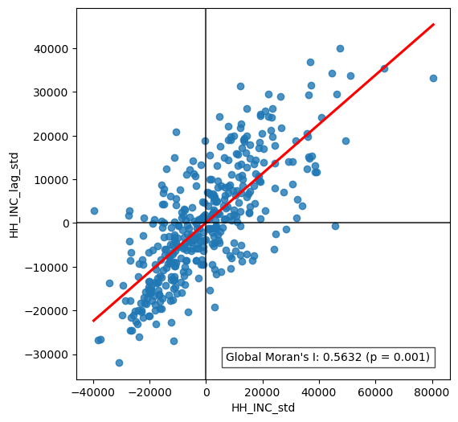{#fig-moran_scatterplot fig-align="center" width="60%"}

On the Moran scatterplot, each observation is plotted with its centered value on the x-axis and its spatial lag on the y-axis. At the global level, the slope of the best-fit regression line through the scatterplot corresponds to the value of global Moran's I [@moran1950], the most widely used SAC statistic. It is defined as

$$ I = \frac{n}{S_0} \frac{\sum_i \sum_j w_{ij} z_i z_j}{\sum_i z_i^2}$$ {#eq-global_i}

where $n$ is the number of observations, $w_{ij}$ is an element of row-standartized $W$, $S_0$ represents the sum of all elements in $W$, and $z_i$ and $z_j$ is the standartized values of observation $i$ and $j$.

The value of $I$ typically falls within the interval $[-1, 1]$. Values close to 1 indicate strong positive spatial autocorrelation, values close to -1 indicate strong negative spatial autocorrelation, and values close to 0 indicate a spatially random pattern.

The $[-1, 1]$ range is a common approximation rather than a strict bound. @dejong1984 show that the true extrema of $I$ for a given weight matrix $W$ are not fixed constants, but a property of $W$ structure itself, related to its eigenvalues. In general, these bounds are not symmetric around 0. @dejong1984 attribute asymmetry in the extrema specifically to structural heterogeneity in the network, most notably boundary effects, where peripheral units have systematically fewer neighbours than interior ones.

A specific structural artefact of $W$ is the isolate, an observation with no neighbours. Isolates arise either from genuine real-world objects (e.g. islands) or from an underlying topological inconsistency in the source data [@anselin2014]. Their presence formally violates the row-standardization of $W$ where every other row is normalized to sum to 1, whereas an isolate's row sums to 0 by definition. This inflates the $N/S_0$ scaling term beyond what the connected portion of the network can actually support, as $S_0$ decreases with each additional isolate while $N$ remains fixed. On these grounds, @anselin2014 recommend that isolates be excluded from both the numerator and the denominator of $I$ altogether, rather than retained as zero-weight rows, not to artificially distort the statistic. Therefore, in the experimental part, topology will be artificially corrupted by removing edges from $W$, while maintaining the no isolates condition.

At the local level, the four quadrants of the Moran scatterplot correspond to four characteristic spatial situations, distinguished by the signs of an observation's value and its spatial lag:

-   High-High (HH): an observation with an above-average value surrounded by neighbours with above-average values - a cluster of high values.

-   Low-Low (LL): an observation with a below-average value surrounded by neighbours with below-average values - a cluster of low values.

-   Low-High (LH): an observation with an above-average value surrounded by neighbours with below-average values - a high-value outlier within a low-value neighbourhood.

-   High-Low (HL): an observation with a below-average value surrounded by neighbours with above-average values - a low-value outlier within a high-value neighbourhood.

The quadrant to which an observation belongs can be read directly from the signs of its centered value and its spatial lag. This classification alone does not indicate whether the observation belongs to that category because of a genuine spatial pattern or by chance. To make this distinction, local indicators of spatial association (LISA) [@anselinLocalIndicatorsSpatial1995] are used together with a test of statistical significance [@reyGeographicDataScience2023]. The most commonly used local indicator is local Moran's $I$ [@wolf2026robust], defined as

$$
I_i = \frac{z_i}{m_2} \sum_{j} w_{ij}z_j \; ; \; m_2 = \frac{\sum_i z_i^2}{n}
$$ {#eq-local_i}

where $z_i$ and $z_j$ are centered values on observation $i$ and $j$, $w_{ij}$ is the spatial weight for a pair of observations $i$ and $j$ and $m_2$ is the second moment (variance). A positive value of $I_i$​ indicates that observation $i$ belongs to an HH or LL quadrant, whereas a negative value indicates that it belongs to an HL or LH quadrant.

Because a specific local Moran's $I$ value can be obtained purely by chance, its statistical significance must be assessed before an observation is interpreted as belonging to a genuine cluster. Significance is typically expressed as a pseudo $p$-value under the null hypothesis that the attribute values are randomly distributed in space and carry no information about their surroundings. The $p$-value is commonly obtained through a permutation procedure, when the observed values are repeatedly reassigned at random to fixed locations (usually 999 times, `esda` default) [@rey2010], local Moran's $I$ is recalculated for each permutation, and the $p$-value is given by the proportion of permutations producing a value as extreme as, or more extreme than, the observed one. An observation is conventionally considered a significant part of a spatial cluster if $p<0.05$ . In practice, results are often visualized as LISA cluster maps, in which only statistically significant HH, LL, HL, and LH clusters are highlighted, while non-significant observations are shown in grey.

{#fig-lisa_example fig-align="center" width="100%"}

On LISA cluster maps of real-world data, the majority of significant clusters are typically HH or LL, compared to few HL or LH outliers, which is consistent with Tobler's first law of geography - similar values tend to occur near one another.

#### Geary $C$

Geary's $C$ [@geary] is another widely used measure of spatial autocorrelation [@reyGeographicDataScience2023]. Its global form is given by

$$
C = \frac{(n - 1)}{2 \sum_i \sum_j w_{ij}} \frac{\sum_i \sum_j w_{ij} (y_i - y_j)^2}{\sum_i (y_i - \bar{y})^2}
$$ {#eq-global_c}

where $n$ is the number of observations, $w_{ij}$ is the spatial weight for a pair of observation $i$ and $j$, $y_i$ and $y_j$ are raw values of observations $i$ and $j$, respectively and $\bar{y}$ is the mean value of the whole dataset. Unlike Moran's $I$, which uses cross-products on the standardized values, Geary's $C$ computes differences of raw values, which in case of very different neigbouring values inflates the $C$ value, making it more sensitive to appearance of local negative SAC. $C$ is bounded below by zero, which indicates strong positive SAC, values close to one indicate random spatial pattern, and any values markably larger than one indicate negative SAC.

The local version, Local Geary's $C$, proposed by @anselinLocalIndicatorsSpatial1995, is defined for each observation $i$ as:

$$
c_i = \sum_j w_{ij}(y_i - y_j)^2
$$ {#eq-local_c}

where $w_{ij}$ is the spatial weight for a pair of observation $i$ and $j$, $y_i$ and $y_j$ are raw values of observations $i$ and $j$,. High values of local $c_i$ highlight areas of abrupt changes in value. As with any LISA, the magnitude of $c_i$ is less important on its own than its statistical significance, which determines whether the identified local pattern is genuine.

#### Gettis Ord $G$

Proposed by @getis1992, the local $G$ is an indicator of positive spatial autocorrelation. It can be defined in two ways, $G_i$ excludes observation's $i$ own value, wheres $G_i^*$ includes it:

$$ G_i = \frac{\sum_{j \neq i} w_{ij} x_j}{\sum_{j \neq i} x_j},G_i^* = \frac{\sum_j w_{ij} x_j}{\sum_j x_j} $$ {#eq-local_g}

where $w_{ij}$ is the weight between observation $i$ and $j$. $G$ captures the overall degree of positive spatial autocorrelation, where high $G$ values are associated with hot spots (areas with homogenously high values) and low values are associated with cold spots (areas with homogenously low values).

Getis-Ord $G$ is complementary to local Moran's $I$ [@reyGeographicDataScience2023]. Local Moran's $I$ primarily distinguishes between spatial clusters (HH/LL) and spatial outliers (HL/LH), but a positive value of local Moran's I does not by itself reveal whether the underlying cluster consists of high or low values. $G$ is specifically designed to make this distinction, identifying whether a concentration of similar values forms a hot spot or a cold spot. However, because $G_i$ and $G_i^*$​ are computed from sums of raw, non-negative attribute values rather than centered or standardized ones, they cannot detect negative spatial autocorrelation [@anselin2024introduction].

As this chapter illustrates, spatial autocorrelation coefficients are fundamentally dependent on the specification of the spatial weights matrix $W$, which enters directly into their computation. This thesis focuses on how the removal of edges from $W$, representing topological errors in a polygonal dataset, affects the behaviour of the resulting statistic, specifically global Moran's $I$.

### Regionalization

Regionalization consists of grouping similar observations together, which we recognize as clustering, but with a spatial constraint that two observations (polygons) can be in the same cluster only if they share a border - contiguity. Regionalization is therefore known as spatially constrained clustering.

The objective of any clustering method is to minimize the dissimilarity within each cluster. The overall dissimilarity of a dataset is described with the sum of all pairwise distances $T$:

$$T = \frac{1}{2} \sum_{i=1}^{n} \sum_{j=1}^{n} d_{ij}$$ {#eq-reg_pairwise_dist}

where $d_{ij}$ is a measure of dissimilarity. $T$ consists of two complementary components: within-cluster dissimilarity $V$ and between-cluster dissimilarity $B$, which can be evaluated during the clustering (regionalization) process:

$$T=V+B$$ {#eq-sum_wb}

where

$$V = \frac{1}{2} \sum_{h=1}^{k} \sum_{i \in h} \sum_{j \in h} d_{ij}, \qquad B = \frac{1}{2} \sum_{h=1}^{k} \sum_{i \in h} \sum_{j \notin h} d_{ij}$$ {#eq-wb_explained}

$W$ acts as a loss function, the goal of clustering is to minimize it. Some methods explicitly use $W$ as the clustering criterion whereas other methods use different metrics to approximate the goal.

By definition, regionalization methods are only meaningful on a connected $W$ consisting of a single component, since a region can only be built from spatial units that are reachable from one another through the contiguity graph [@yuan2015]. For this reason, the edge-removal procedure used in the experiments is constrained to preserve global connectivity: edges are only removed if their deletion does not disconnect $W$ into multiple components.

This chapter will serve as an overview of widely used methods discussed in @anselin2024. In the experimental part, two of those methods will be tested for robustness to polygonal coverage violations - *Spatially constrained hierarchical clustering* (SCHC) and *Spatial 'K'luster Analysis by Tree Edge Removal* (SKATER),

#### Spatially constrained hierarchical clustering {#sec-schc}

Spatially constrained hierarchical clustering (SCHC) is a bottom-up approach, where each observation starts as its own cluster ($k=n$) and the clusters (or single observations) are being recursively merged based on their dissimilarity. It is based on agglomerative clustering with a contiguity constraint. It is a greedy algorithm, therefore once the observations are merged, they cannot be split in another iteration.

Dissimilarity is computed based on definition of cluster distance (Euclidean in vast majority of cases) in attribute space, referred to as linkage criterion. The four main types of linkages are:

-   Single linkage: dissimilarity is the minimum distance between any pair of observations drawn from the two clusters.
-   Complete linkage: dissimilarity is the maximum distance between any pair of observations drawn from the two clusters.
-   Average linkage: dissimilarity is the average distance over all pairs of observations, one drawn from each cluster.
-   Ward's linkage: dissimilarity is the increase in total within-cluster $SSD$ (see @eq-ssd) that would result from merging the two clusters.

The dissimilarity is denoted in dissimilarity matrix $D$, which is initially $n \times n$ as each observation starts as its own cluster. Each element $d_{ij}$ represents the dissimilarity between each pair of clusters (or single observations). At each step, the algorithm merges the two clusters/observations, that have the smallest dissimilarity (smallest value from $D$) under the contiguity constraint. After each merge, $D$ is updated using an updating formula, that computes the dissimilarities between the new cluster $C$ and a cluster $P$, reducing both dimensions of $D$ by one in each iteration.

Ward's method, developed by @ward1963, explicitly minimizes the within-cluster dissimilarity (variance) defined trough the sum of squared errors ($SSD$). The input structure to use Ward's method is a $n \times p$ matrix $X$, where $n$ is the number of observations, $p$ is the number of variable and each element represents the (standardized) value of each variable for each observation. $SSD$ can be then formally defined as:

$$SSD = \sum_{i \in C} (x_i - \bar{x}_C)^2$$ {#eq-ssd}

where $x_i$ is a single row of $X$ (the vector of attributes for observation $i$) and $\bar{x}_C$ is the centroid of all observations in cluster $C$. Intuitively, the overall $SSD$ increases when we merge two clusters, so the goal at each step is to choose the merge that increases $SSD$ by the smallest possible amount. This turns out to be equivalent to merging the two clusters whose centroids are closest based on a dissimilarity matrix $D$. Ward's method expresses the dissimilarity trough the square of the Euclidean distance, therefore the dissimilarity between clusters is defined as

$$d^2_{AB} = \frac{2n_A n_B}{n_A + n_B} \| \bar{x}_A - \bar{x}_B \|^2$$ {#eq-dissimilarity}

Unlike average linkage, which computes the unweighted mean of pairwise distances between individual observations in the two clusters, Ward's linkage evaluates merges by their contribution to total within-cluster variance, weighting the squared centroid distance by the size-dependent factor $\frac{2n_An_B}{n_A+n_B}$. Because this factor grows with the product of the two cluster sizes, merges between two already large clusters are comparatively costly, whereas a small cluster can still be absorbed into a much larger one at low cost [@lance1967].

After two clusters $A$ and $B$ are merged into a new cluster $C$, the dissimilarities between $C$ and every other cluster $P$ can be computed without recalculating centroids, using the Lance-Williams updating formula [@lance1967]:

$$d^2_{PC} = \frac{n_A + n_P}{n_C + n_P} d^2_{PA} + \frac{n_B + n_P}{n_C + n_P} d^2_{PB} - \frac{n_P}{n_C + n_P} d^2_{AB}$$ {#eq-dissimilarity-updating}

As mentioned above, the clusters/observations can be only merged under the contiguity constraint, which is denoted in spatial weights matrix $W$. For this thesis, we will assume a binary $W$, meaning that observations $i$ and $j$ can be merged only if $w_{ij}=1$. After the merge, $W$ needs to be updated. If $i$ and $j$ were merged into a new cluster $C$, $i$-th and $j$-th row and column will be replaced by $C$. The relationship between $C$ and the rest of the clusters $P$ will be set to $w_{PC}= 1$ if $w_{iP}=1 \lor w_{jP}=1$, inheriting all the neighbours of both $i$ and $j$.

In practice, the number of clusters (regions) $k$ is fixed in advance, and the merging process stops once this number is reached. This corresponds to "cutting" the hierarchical tree refered to as dendrogram, displayed in @fig-dendrgram, at the appropriate height.

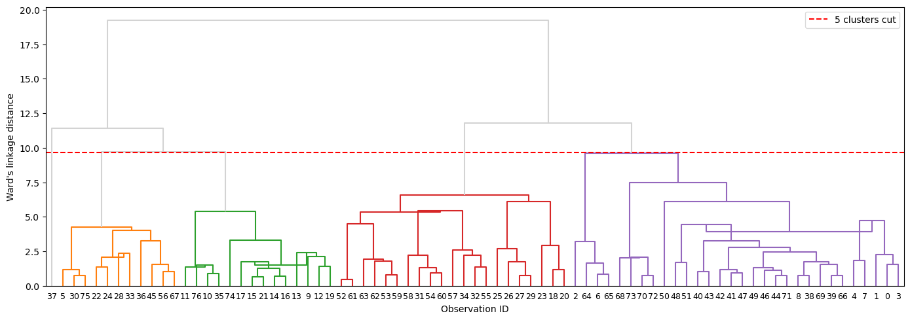{#fig-dendrgram fig-align="center"}

#### SKATER {#sec-skater}

Spatial 'K'luster Analysis by Tree Edge Removal (SKATER), developed by @AssuncaoSkater, is another hierarchical regionalization method. Unlike SCHC, it is not agglomerative, but divisive. It is based on pruning (illustrated in @fig-skater_partitioning) a minimum spanning tree (MST) - a subgraph that connects all nodes of a graph using the subset of edges with the minimum possible total edge weight, without forming any cycles. The MST is usually built using Prim's or Kruskal's algorithm.

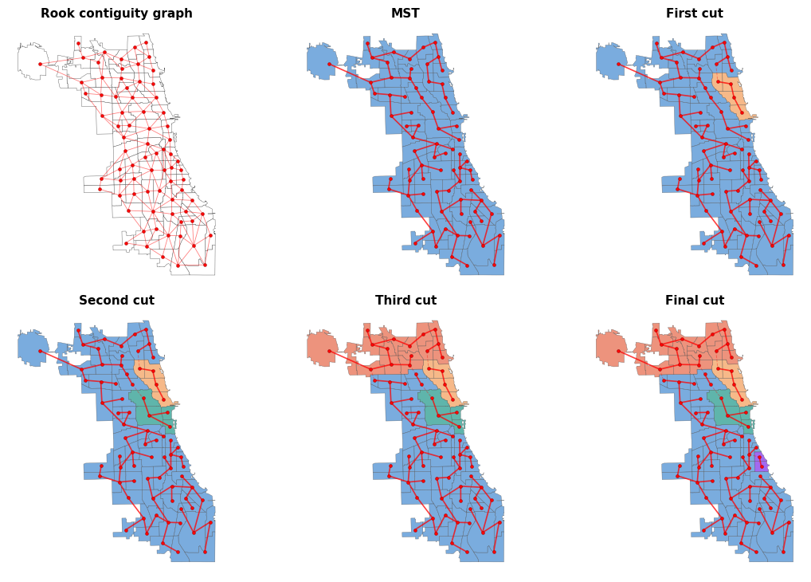{#fig-skater_partitioning fig-align="center" width="80%"}

For the SKATER algorithm, MST is a subset of edges from contiguity spatial weights graph (see definiton in @sec-contiguity). The weights are assigned to each $(i,j)$ edge based on the dissimilarity between the attribute vectors of observations $i$ and $j$, typically their squared Euclidean distance in attribute space:

$$d(i, j) = d(x_i, x_j) = \sum_{l=1}^{n} (\mathbf{x}_{il} - \mathbf{x}_{jl})^2$$ {#eq-euclidean_distance_skater}

where $x_i$, $x_j$ are attribute vectors of observations $i$ and $j$.

All observations are considered to be in one region and they are connected by the initial MST, which has exactly $n-1$ edges. The MST is pruned by removing an edge which increases the between-cluster dissimilarity the most. This is accessed trough calculating the sum of squared deviations (see @eq-ssd). Removing an edge splits a tree $T$ into two subtrees $A$ and $B$. The resulting reduction in within-cluster dissimilarity is given by

$$\Delta SSD=SSD_T-(SSD_A+SSD_B)$$ {#eq-ssd_skater}

At each step, SKATER removes the edge that maximizes $\Delta SSD$, i.e. the split that most reduces the combined within-cluster dissimilarity of the two resulting subtrees. This process is repeated $k-1$ times, recursively splitting the resulting subtrees, until the desired number of regions $k$ is reached.

#### REDCAP

Developed by @guo2008, Regionalization with dynamically constrained agglomerative clustering and partitioning (REDCAP) consists of both merging and divisive processes, combining SCHC and SKATER.

The first part of the algorithm is structurally identical to SCHC - it builds an entire dendrogram. It has a dissimilarity matrix, which we can also think of as a complete graph. That is a graph, that connects all pairs of possible observations with assigned weight based on their dissimilarity. The dissmilarity is based on the linkage parameter (see @sec-schc). In the original paper, @guo2008 omits Ward's linkage, though it is implemented in Geoda [@anselin2006GeoDa].

REDCAP introduces an additional parameter governing which observations are considered when computing within-cluster dissimilarity. Two constraining strategies are defined:

-   First-order: only edges connecting individual boundary observations from different clusters are considered.
-   Full-order: All edges connecting observations from different clusters are considered. This is equivalent to standard SCHC.

In other words, first-order restricts attention to the observations actually sitting on the shared border between two clusters, while full-order treats the two clusters as if every cross-cluster pair were equally relevant.

At each iteration, the pair of neighbouring clusters with the smallest between-cluster dissimilarity is merged, exactly as in SCHC. This repeats until all observations belong to a single cluster and the dendrogram is complete.

The key addition is that, at every merge, REDCAP also adds one edge to a minimum spanning tree (MST), specifically, the minimum-weight edge connecting the boundary observations of the two clusters being merged. By the time the dendrogram is finished, a full MST has been built alongside it, without any extra computation beyond the merging process itself.

After the whole MST is built, the pruning process is the same as in SKATER, meaning $k-1$ edges are removed from the MST to reach $k$ regions. When REDCAP's First-Order Single-Linkage is used, the MST is identical the SKATER's one (as well as the resulting regionalization), as it implicitely uses Kruskal's algorithm.

#### AZP

Automatic Zoning Procedure (AZP) was proposed by @openshaw1977 and extended in @openshaw1995. Unlike the approaches discussed above, AZP is not hiearchical. It starts from a complete initial assignment of all $n$ observations to $p$ contiguous regions. For each region, the within-cluster $SSD$ is calculated using @eq-ssd. Total within-cluster $SSD$ corresponds to the sum of all within-cluster $SSD$s.

The algorithm randomly picks one of the $p$ regions (called $c$) and identifies the set $C$ of all observations that belong to a different region but are spatially adjacent to at least one observation in $c$. From $C$, an observation $i$ is randomly selected as a candidate to leave its current region and join $c$. For that move to be accepted, two conditions must be satisfied:

-   it must not break the contiguity of $i$'s origin region,
-   it must decrease the total within-cluster $SSD$.

If both conditions are satisfied, $i$ is added to region $c$ and $C$ is updated to include any new neighbours introduced by the move. This process continues until $C$ is empty. This full cycle over all regions is repeated from the beginning until a complete pass produces no accepted swaps, at which point no further improvement in total $SSD$ is possible.

AZP does not guarantee a global optimum and can easily become trapped in a local optimum @anselin2024. It therefore has several additional parameters that can improve results. One such parameter is the *search option*. The default greedy local search only accepts improving moves. *Tabu search* augments this by maintaining a list of recently moved observations that are temporarily prohibited from returning to their origin region, preventing cycling and allowing the algorithm to escape local optima. *Simulated annealing* uses the Metropolis algorithm, proposed by @metropolis1953, to accept non-improving moves with a probability that decreases over time, introducing controlled randomness early in the search to escape local optima while converging towards a stable solution in later iterations.

The other parameter concerns the *initial regionalization*. *Automatic Regionalization with Initial Seed Location* (ARiSeL) constructs better initial solutions by selecting seeds based on their spatial separation and attribute dissimilarity using a K-means++ procedure, rather than relying on random placement. Another option is to supply the output of a hierarchical method such as SCHC or SKATER as the starting assignment. Since hierarchical methods cannot rearrange observations once they are placed in a branch, using their output as an AZP starting point allows boundary observations to be swapped and the solution refined [@anselin2024].

#### Max $p$-regions problem {#sec-p_regions}

Proposed by @duque2012, the max-$p$ regions problem seeks to find the maximum number $p$ of contiguous regions such that each region meets a minimum size constraint, typically expressed as a lower bound on a spatially extensive attribute (e.g. total population).

The heuristic consists of three phases. In the growth phase, an observation is randomly selected as a seed. Unassigned neighbours are added one at a time, always choosing the neighbour with the largest threshold attribute, until the cumulative value of the growing region meets the threshold. A new seed is then selected and the process repeats. Any seed whose own attribute value already exceeds the threshold immediately forms a singleton region. Observations that cannot be incorporated, because all their neighbours are already assigned or the minimum bound cannot be reached, are placed in the enclave. The growth phase is repeated many times from different random starting points; only the layouts achieving the largest $p$ are retained.

In the enclave assignment phase, every observation in the enclave is allocated to a neighbouring existing region so as to minimize the increase in total within-cluster $SSD$ (see @eq-ssd).

<!-- If multiple enclave observations can each join different neighbouring regions, all combinations are evaluated and the assignment minimizing total $SSD$ is chosen. -->

The outcome of the first two phases is the initial feasible solution, which is then refined using the same search procedures as AZP - greedy local search, tabu search, or simulated annealing, to minimize total $SSD$ while preserving contiguity and the minimum size constraint. As with AZP, max-p results are highly sensitive to parameter choices: the minimum bound value, the number of growth iterations, and the chosen search strategy, therefore extensive experimentation is recommended [@anselin2024].

## Topology in geography

Topology is a mathematical discipline that “studies properties of spaces that are invariant to continuous deformation” [@waterloo_topology]. In geographic context, it means focusing strictly on the spatial relationships between features, such as connectivity, adjacency, and containment (citace), rather than their absolute geometric shape, distance, or magnitude.

Topological relationships are essential in numerous geographical disciplines, such as landscape ecology using overlay analysis, hydrology and the geography of transport relying on network analysis and line adjacency, as well as cartography and spatial statistics examining border topologies [@papadimitriou_geo-topology_2023]. Topology is of particular relevance to this thesis, since correctly identified topological relationships underpin the accurate construction of contiguity-based spatial weight matrices $W$.

<!-- Probably one of the most important connections between topology and geography is the Four Colour Theorem, proposed by Francis Guthrie in 1852. It states that any planar map consisting of polygons can be coloured using only four colours without any pair of neighbouring polygons sharing the same colour. The theorem was proven more than a hundred years later by @appel1977fourcolor1, and it relied entirely on topological principles, specifically polygonal adjacency.-->

<!-- The discipline was formally established in the early 20th century, however its roots trace back to Leonhard Euler’s solution to the Seven Bridges of Königsberg problem (@euler1741solutio). The objective of the problem was to cross every bridge in the city exactly once and return to the starting point. The physical distances and exact shapes of the landmasses were entirely irrelevant to the solution, the outcome depended solely on knowing which bridges connected which landmasses. By abstracting the city into a graph (see definition in chap. xx) while preserving the information about the connectivity of the landmasses, he was able to solve the problem. --->

The formal study topological relationships is rooted in point-set topology, also known as general topology, as it is the foundation to many other related disciplines. It relies on the concepts set theory, introduced by @cantor1874, like set operations (e. g. intersection, union, complement), as well as the fundamental notions of subsets, open sets, and neighborhoods. Furthermore, point-set topology concepts like interior, boundary and exterior, introduced by @hausdorff1914grundzuge, are the foundation for topological models, used in modern GIS to formalize topological relationships.

This chapter first introduces topological models as the general GIS concept underlying topology, then examines topological validity, focusing on polygonal coverage and methods for its correction.

<!--A topological space is a pair $(X, \tau)$, where $X$ is a set of points and $\tau$ is a collection of subsets of $X$ (the topology). $\tau$ must satisfy the following axioms: 1. Any union of elements of $\tau$ belongs to $\tau$. 2. Any finite intersection of elements of $\tau$ belongs to $\tau$.$X$ and $\emptyset$ belong to $\tau$.-->

<!--Based on the definition of topological space, @hausdorff1914grundzuge formally defined the interior, boundary and exterior of a set. These three topological properties are the core of topological models used in spatial analysis. Given a set $Y$ in topological space $(X, tau)$: interior (doplnim),boundary,exterior -->

<!--This phenomena is used across other fields. Among the most notable applications of graphs on topological relationships, Kirchhoff (1847) represented an electrical circuit as a graph, implicitly using tree structures (see chapter xx) to identify independent circuit equations. A tree in the context of graph theory was later formalized by Cayley (1857), who used graphs to represent chemical structures.-->

### Topological models

During the 1980s, terms for spatial relations were mentioned in literature, however, they lacked formal definitions and were mostly treated as axiomatic [@egenhoferPointsetTopologicalSpatial1991]. The first rigorous framework for topological relationships was the *4-Intersection Model* (*4-IM*) developed by @egenhoferPointsetTopologicalSpatial1991. It applied interior and boundary definitions from point set topology to a geospatial context. The *4-IM* served as the predecessor to the *Dimensionally Extended 9-Intersection Model* (*DE9-IM*) [@clementiniSmallSetFormal1993], which is now the standard adopted by the *Open Geospatial Consorcium* (*OGC*). Expanding the *4-IM*, it is based on a 3×3 matrix of all possible intersections between interior, boundary and exterior of two geometries (point, line or polygon) and further describes the dimension of those intersections:

$$\text{DE-9IM}(a,b) = \begin{bmatrix} \dim(a^\circ \cap b^\circ) & \dim(a^\circ \cap \partial b) & \dim(a^\circ \cap b^-) \\ \dim(\partial a \cap b^\circ) & \dim(\partial a \cap \partial b) & \dim(\partial a \cap b^-) \\ \dim(a^- \cap b^\circ) & \dim(a^- \cap \partial b) & \dim(a^- \cap b^-) \end{bmatrix}$$ {#eq-de9im}

where $a$ and $b$ are the input geometries, $a^\circ$, $b^\circ$; $\partial a$, $\partial b$; and $a^-$, $b^-$ denote the interior, boundary, and exterior of geometries $a$ and $b$, respectively. The operator $\cap$ represents the set intersection, and $\dim(X)$ returns the maximum topological dimension of the intersection:

-   False (-1) if there is no intersection,
-   0 if the intersection is a point,
-   1 if the intersection is a line,
-   2 if the intersection is a polygon.

In most use cases, non-empty intersections (0, 1 or 2) can be universally treated as $True$ when the result is invariant to the intersection dimension. However, for defining contiguities the dimension of the intersection is required as discussed in @sec-contiguity. Specific value combinations in the matrix have standard names, which are referred to as spatial predicates. The *C++* library *GEOS* - a core dependency of many libraries (e. g. *Shapely*, *Geopandas*), databases (e. g. *PostGIS*), and applications (e. g. *QGIS*) - recognizes 9 spatial predicates (see tab) @geos. For computational purposes, the matrix is often flattened into a 9-character DE-9IM string.

+-------------------+-------------------+-------------+----------------------------------------+
| Spatial predicate | DE-9IM string     | Description | Illustration?                          |
+:=================:+===================+=============+========================================+
| Intersects        | ??                |             |                                        |
+-------------------+-------------------+-------------+----------------------------------------+
| Touches           | FT\*\*\*\*\*\*\*\ |             |                                        |
|                   | F\*\*T\*\*\*\*\*\ |             |                                        |
|                   | F\*\*\*T\*\*\*\*  |             |                                        |
+-------------------+-------------------+-------------+----------------------------------------+
| Disjoint          | FF\*FF\*\*\*\*    |             | {width="30%"} |
+-------------------+-------------------+-------------+----------------------------------------+
| Crosses           | T\*T\*\*\*\*\*\*\ |             |                                        |
|                   | 0\*\*\*\*\*\*\*\* |             |                                        |
+-------------------+-------------------+-------------+----------------------------------------+
| Within            | T\*F\*\*F\*\*\*   |             |                                        |
+-------------------+-------------------+-------------+----------------------------------------+
| Contains          | ??                |             |                                        |
+-------------------+-------------------+-------------+----------------------------------------+
| Overlaps          | T\*T\*\*\*T\*\*   |             |                                        |
+-------------------+-------------------+-------------+----------------------------------------+
| Equals            | TFFFTFFFT         |             |                                        |
+-------------------+-------------------+-------------+----------------------------------------+
| Covers            | ??                |             |                                        |
+-------------------+-------------------+-------------+----------------------------------------+

: Spatial predicates. - tohle taky dopnim

Software libraries implement these predicates alongside additional ones as boolean functions, such as modified formulations (e. g. `contains_properly` in *Shapely* library) or inverse relationships (e. g. `covered_by` in *Shapely*). Custom spatial queries can be formalized by defining the flattened DE9-IM string (e. g. `relate` in *Shapely*, `ST_relate` in *PostGIS*). Topological relationships derived from *DE-9IM* are the underlying framework for many spatial operations including overlay analysis, contiguity detection, and topology validation.

Because contiguity detection relies directly on the topological properties of a polygonal dataset, these spatial relationships can be rigorously defined using the DE-9IM. In libraries such as libpysal, contiguity is established by evaluating this topological matrix. For instance, Queen contiguity satisfies the standard `touches` spatial predicate. Rook contiguity is defined by the DE-9IM string `F***1****`, which mandates that the intersection of the two polygon boundaries must be exactly 1-dimensional (a shared edge).

### Topological validity and polygonal coverage

Spatial data often suffers from errors from a variety of sources. These inaccuracies are typically introduced during manual vectorization or data entry, data transfer, geometric editing operations (such as simplification or reprojection), or the integration of heterogeneous datasets of varying ages [@spatialeye_topology, @gisgeography_topology, @servigne2000].

@servigne2000 categorizes spatial consistency errors into three primary types:

-   **Structural errors:** Arising when the chosen data structure cannot adequately accommodate the data model.
-   **Geometric errors:** Conceptually invalid geometry (e. g. self-intersecting polygons).
-   **Topo-semantic errors:** Occurring when the geometric representation violates real-world logical constraints (e.g., a single building footprint incorrectly intersecting two distinct parcels).

Geometric and topo-semantic errors are particularly problematic when detecting topological relationships, as they are not immediately noticable. The most commonly used data structures in modern GIS are "spaghetti" models (e.g., GeoJSON, Shapefile, Parquet, and GeoPackage). These models store each geometry as an isolated record with no information about their mutual relationships, therefore they need to be derived from the geometry (vertices). In presence of geometrical inaccuracies, accurate detection of topological relationships is impossible.

According to @ubedaTopologicalErrorCorrecting1997a, the topology error correction process consists of three steps: definition, checking, and correction. Definitions of the errors is esentially establishing the spatial constraints input data must satisfy. These user-defined constraints are derived from formal spatial predicates. Many of these rules are explicitely implemented as ready-to-use topology checkers in desktop GIS software like *QGIS* and *ArcGIS Pro* (e. g. `must not have dangles` for line features, `must not overlap` for line or polygonal features).

#### Polygonal coverage

Polygonal coverage, or also planar enforcement, is a specific selection of topology rules. It is a strict requirement for contiguity detection [@rey2022PySAL]. Geoplanar [@geopanda2026], a python package developed for planar enforcement of Geopandas datasets, considers five planar enforcement violations, see table/fig.

-fig violations and names

**Overlaps** occur when two polygons share part of their interior. They are identified using the `overlaps` spatial predicate, which returns an array of index pairs corresponding to overlapping geometries. The violation can be resolved either by trimming one of the polygons to remove the shared area, or by merging the two polygons into one.

**Gaps** are detected by converting polygon boundaries to linestrings and exploiting a key property of planar enforcement: when two polygons share an edge perfectly, their coincident boundaries merge into a single linestring after `union_all`. Where a gap exists, the edges do not coincide and remain as separate LineStrings, enclosing the void between them. `polygonize` then reconstructs every closed face from this line network, producing both the original polygons and any gap polygons as closed faces. The resulting set is filtered against the original GeoDataFrame using the `covers` predicate - gap polygons are not covered by any input polygon, since no input geometry claims that space.

**Omitted interiors** arise when a polygon lies entirely within another polygon, meaning the larger polygon should contain a hole, but none is encoded in its geometry. They are identified using the `contains` spatial predicate. The violation is corrected by subtracting the smaller polygon from the larger one, leaving a correctly encoded hole in the larger geometry.

In presence of **non-planar edges and touches**, contiguity detection is compromised. *Rook* contiguity considers two polygons neighbours if they share at least two consecutive vertices, and those vertices must be explicitly present and encoded in both polygons, stricter than a pure spatial predicate testing for overlapping boundaries. *Queen* contiguity similarly requires a shared vertex to exist in both geometries. Geoplanar detects violations by subtracting a *Queen* contiguity graph from a fuzzy contiguity graph, where fuzzy contiguity captures geometrically adjacent pairs regardless of shared vertex encoding. Pairs that appear in the fuzzy graph but not in the *Queen* graph are flagged as non-planar. The violation is corrected by inserting additional vertices into the relevant geometries, ensuring that every shared edge is encoded with a consistent set of vertices on both sides.

In addition to Geoplanar, several other tools address topology checking. JTS Topology Suite (JTS) @jtsLinearThinkingPolygonal2022, an open source Java software library, can evaluate an entire polygonal coverage, returning error strings with the specific coordinates of violations. Desktop software like QGIS and ArcGIS Pro evaluate the selected topology rules (i. e. for polygonal `coverage must not overlap` and `must not have gaps`) and visually highlight every error on the map. Mapshaper temporarily converts the spaghetti model into an explicit topological data structure. Instead of storing independent geometries in rows, Mapshaper decomposes a polygonal dataset into an arc-node graph: creating edges (arcs) for boundaries and nodes where three or more polygons intersect. Polygons are then defined mathematically through sequences of these shared arcs, eliminating coordinate redundancy. In this explicit topological structure, the information detailing which polygons neighbor each other is inherently stored within the data model itself.

As an alternative to strict topological contiguity, [@rey2022PySAL] implement Fuzzy contiguity as part of PySAL. It doesn't change the geometry of polygons, but it is a tool to generate $W$ without requiring strict topological relationships. By default, it creates a buffer (automatic or user-specified) around the polygonal geometries. Buffered polygons, that meet the spatial predicate `intersects` (by default) are then considered to be neighbours and this relationship is denoted in $W$.

-diagram pro premka

Even though tools to refine topology or build contiguity without strict topological requirements exist, in practice such checking is often omitted, or, if performed, carried out by users without formal GIS training who may not recognize such phenomena. As a result, spatial datasets used in downstream analysis frequently retain unresolved topological errors. Since contiguity $W$ directly rely on the topological relationships between polygons, the errors propagate into $W$ itself and from there to any analysis, that relies on it. This thesis investigates what consequences follow for spatial autocorrelation and regionalization outcomes specifically.

### Erroneous datasets??

## Related work

A critical gap in the current literature is the lack of research explicitly isolating the direct impact of topological errors on spatial statistical methods. This literature review chapter is dedicated to conceptually and methodologically similar studies. First, it introduces the broader landscape of spatial data uncertainty and errors, and their impact. Next, it discusses the specification of spatial weights matrices and Modifiable Area Unit Problem and its impacts on spatial analysis. Lastly, it focuses on graph degradation, which in the context of spatial weights is omitted in the literature, however, it is used in simulating transport network disruption among others.

### Data uncertainty

@fisher1999models distinguishes three primary forms of uncertainty in spatial data: error, vagueness, and ambiguity. While vagueness and ambiguity reflect uncertain properties of the phenomenon itself, error occurs when a well-defined object's position or attribute deviates from the ground truth. This thesis is concerned with a specific form of the latter: positional error in boundaries, resulting in incorrectly built spatial weight matrix. Standard spatial analytical workflows assume that input geometries and the adjacency relations derived from them are exact, therefore it is often not taken in account for.

One way to approach positional uncertainty of boundaries (line segments) is a band around the line derived through a specific statistical or mathematical procedure. An overview of band-based approaches can be found in @tong2010. The simplest of these is the epsilon band [@perkal1956epsilon; @chrisman], a deterministic uniform buffer drawn along the line under the assumption that the true line lies entirely within it. One application of this model is the detection of sliver polygons in temporal land-use data: @mas2005 uses the epsilon band to classify change polygons as false change when they fall entirely within the boundary uncertainty zone, while @delafontaine2009 develop a broader semi-automated method for sliver assessment in overlaid vector layers, demonstrating that these spurious polygons are a direct and measurable consequence of positional error in map overlaying.

The impact of such positional error on spatial optimization has been explicitly tested by @wei2012 and @weiHarvest2012a. The latter applies this logic to forest harvest scheduling via the Unit Restriction Model (URM), in which no two spatially adjacent harvest units may be cut simultaneously. Since adjacency is determined from polygon boundaries, positional error in those boundaries can possibly corrupt the adjacency set on which the entire model depends. @weiHarvest2012a partition each unit's adjacency set into certain and possible neighbors using an epsilon-based boundary uncertainty estimate. The results reveal that the error-blind model identifies a single deterministic solution, while incorporating boundary uncertainty expands this to a wide range of possible outcomes, spanning a reduction of nearly 5% in the conservative case to an increase of over 17% in the most aggressive. @weiHarvest2012a conclude that ignoring spatial uncertainty risks producing solutions that are erroneous, biased, or misguided.

Alongside band-based approaches, Monte Carlo simulation offers a practical alternative that generates an ensemble of stochastic realizations rather than a single geometric representation of the error zone. @declercq2009 apply this logic directly to positional error in historical forest vector maps, generating the sliver polygons that result from overlaying misregistered map pairs. The choice of simulation over a simple linear shift or uniform error model is explicitly motivated by the non-linear, spatially heterogeneous nature of real positional error, demonstrating boundary corruption is governed by landscape geometry, identifying edge density and the number of patches as the primary drivers of vulnerability.

While the studies above focus on positional error, spatial data is also subject to attribute uncertainty, where recorded values deviate from the true characteristics of a unit rather than its position. @wei2022 develop the uncertain-max-$p$-regions problem (see @sec-p_regions for context) to incorporate attribute uncertainty into contiguity-constrained regionalization, demonstrating that regionalization outputs are sensitive to data uncertainty. Crucially, the authors note that positional error also may effect the outcomes of regionalization algorithms and that there is the need to address these.

<!-- Epsilon bands can be used when adressing the sliver polygons in dataset, which is a form of topological error. @mas2005 employed it, classifying any change polygon falling completely within it as false change. When applied to a synthetic dataset with zero true change, this method successfully eliminated 95% of the artificially generated sliver polygons, though the author cautions that excessively wide bands risk erasing narrow, legitimate geographic features. To address positional uncertainty in spatial optimization, @wei2012 introduced the multi-objective Error-Anti-Covering Location Problem (E-ACLP) to evaluate sex offender residency dispersion laws, which require a mandatory 1,320-foot separation distance $\Gamma$ between households. The E-ACLP embeds a $\pm$ 100-foot geographic error margin $\epsilon$ by mathematically partitioning proximity constraints into a certain conflict set (less than $\Gamma - \epsilon$) and an uncertain conflict set (between $\Gamma - \epsilon$ and $\Gamma + \epsilon$). The model then maximizes total legal residences while minimizing a penalty function that charges a uniform cost of 1 for every uncertain constraint it is forced to relax. The results demonstrate that while an error-blind model identifies an upper bound of 16 residences, the E-ACLP maps a risk spectrum from an ultra-conservative 15 residences up to an aggressive 19 residences, revealing that maximizing capacity to 19 requires accepting 22 potential proximity violations. Several studies adress the impact of positional error on change detection, generating "false change". This false change is attributed to sliver polygons, caused by boundary misalignments between compared datasets across two time periods, which fundamentally represent a form of topological error. @mas2005 employed a probabilistic epsilon band [@perkal1956epsilon, @chrisman] around boundaries, classifying any change polygon falling completely within it as false change. When applied to a synthetic dataset with zero true change, this method successfully eliminated 95% of the artificially generated sliver polygons, though the author cautions that excessively wide bands risk erasing narrow, legitimate geographic features. -->

### MAUP

Another related phenomena leading to bias in spatial data analysis is the Modifiable Area Unit Problem (MAUP). Established by @gehlke1934 and further described in @openshaw1983, it concerns the aggregation of spatial units and how that influences the summary statistics. @openshaw1983 decomposes the problem into two sub-effects: a scale effect, arising from the number of areal units a region is partitioned into, and a zoning effect, arising from how those units are grouped at a fixed count. MAUP's effect has been studied on a range of spatial analytical techniques including multiple and spatial econometric regression [@fotheringham1991; @arbia2011], geographically weighted regression [@murakami2015], geostatistical interpolation [@kyriakidis2004; @kyriakidis2005; @atkinson2000], and also addressed in regionalization techniques [@duque2012; @bradley2017].

MAUP also influences outcomes of spatial autocorrelation statistics. @amrhein1997 show that a modified Getis statistic correlates strongly with aggregation-induced variance change across census variables, and that this relationship is significantly weaker and less predictable when aggregation is performed hierarchically rather than independently at each scale. @zhang2019 quantify this relationship further, finding that Moran's I decays with aggregation level according to a consistent negative logarithmic function across 30 independent study areas, with the rate of decay significantly correlated to the spatial complexity of the underlying geometry.

@lee2019 specifically isolate the scale and zoning effects by generating spatially autocorrelated surfaces at controlled initial autocorrelation levels and aggregating them across multiple scales, testing the resulting mean, variance, and Global Moran's $I$ at each combination. The results show that Global Moran's $I$ itself is shaped by both effects in ways that depend critically on the initial autocorrelation level: values computed from very different starting points converge toward a common value as aggregation increases, but this convergence is asymmetric between positive and negative autocorrelation. Data with extreme positive autocorrelation retain a high Global Moran's $I$ through most aggregation levels before dropping sharply only at the coarsest scales, whereas data with extreme negative autocorrelation change rapidly at the start and stabilize earlier. The zoning effect is larger under negative autocorrelation, with greater variability across random zonations at a given aggregation level than under positive autocorrelation. This asymmetry is most pronounced at the extremes of the autocorrelation spectrum, while surfaces with near-zero initial autocorrelation behave symmetrically around the convergence point.

### Specification of weight matrix

Althought the behaviour of spatial statistics on corrupted $W$ has not been properly researched, various studies exist regarding the $W$ specification. That is, the consequences of choosing differently among valid representations of spatial relationships. Misspecification in the traditional sense treats $W$ as a modelling choice where different legitimate options exist, whereas this thesis treats $W$ as a quantity with a ground truth that topological error can silently corrupt. This existing literature provides both conceptual and methodological similarities to this thesis.

A first cluster of studies, which rely on regular lattices and simulated rather than empirical data, established that the density and configuration of $W$ affects both test power and parameter recovery [@stetzer1982; @anselin1991; @floraxImpactsMisspecifiedSpatial1995; @kelejian1998; @griffith1998; @smith2009]. Across this literature, denser and more highly connected matrices consistently reduced test power and biased the spatial dependence parameter downward, while a mismatch between the $W$ used to generate the data and the $W$ used to test or estimate the model degraded both.

@farber2009 argued that real geographic systems occupy a narrow, specific region of topological space distinct from artificial grids, and, generating synthetic networks with independently tunable degree distribution and clustering, found that degree remained a strong predictor of test power while clustering did not. @stakhovych2009 adopted this critique methodologically, re-running the classical sensitivity question on irregular Voronoi tessellations.

### Graph degradation

Corrupting $W$ by removing edges to asses the robustness of spatial statistical methods has not been yet employed, however, methodologically similar studies exist within the field of transport network analysis [@cohen2000; @latora2001; @latora2005; @jenelius2012; @duan2014; @mattsson2015; @zhang2015; @wang2019; @dong2019] with an applicable design: random or specifically targeted edges or nodes are removed and some measure of vulnerability is being tested.

The consistent finding is that random removal is comparatively harmless while removal guided by structural importance or spatial concentration is more damaging. @han2009 and @berche2009 reach this conclusion comparing random removal against centrality-based attack strategies on public transport networks and @berezin2015 show that a geographically localized attack can trigger complete collapse, whereas the same networks can survive random failure of a comparable or even much larger extent.

# Methodology

This simulation was implemented in Python using Jupyter notebooks, relying primarily on `pandas` and `geopandas` for tabular and geospatial data storage, `libpysal` for spatial weight matrix operations, and `matplotlib` for visualization. The overall workflow is shown in @fig-overall_pipeline. Computations were carried out on computer xxx with parameters xxx.

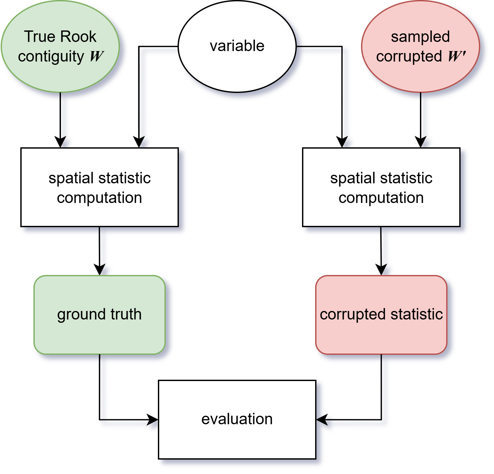{#fig-overall_pipeline fig-align="center" width="50%"}

The analysis focuses on robustness to topology corruption across two families of spatial statistics: spatial autocorrelation and regionalization. Both are evaluated on synthetic and real datasets (see @sec-syn and @sec-real).

True Rook contiguity graph $W$ is then derived from each GeoDataFrame, from both synthetic and real data, using `libpysal.graph.Graph.build_contiguity()`. This matrix is subsequently corrupted by removing edges to simulate topological inconsistencies, so that contiguity between certain polygons is no longer detected. The corruption procedure is detailed in @sec-corruption.

The relevant statistic is then computed once using the true $W$, which serves as the ground truth, and on a set of corrupted $W'$, representing the corrupted results. The outcomes are compared and evaluated, as described in @sec-eval.

## Synthetic data {#sec-syn}

For the synthetic datasets, a regular lattice geometry is first generated (see @sec-grid) and stored in a geopandas GeoDataFrame. Attribute values are then simulated separately for the autocorrelation and regionalization tests, as described in @sec-sac_sar and @sec-reg_syn, respectively. The graph corruption process on synthetic lattices is described in @sec-corruption.

### Lattice generation {#sec-grid}

To test robustness of spatial statistics under supervised conditions, three lattice geometries were considered - square, pentagonal (A5) and hexagonal (H3). Lattice geometry influences the number of average number of neigbours per observation. All three geometries were generated in three different dataset sizes - $n=25$ (5×5 grid), $n=100$ (10×10 grid), and $n=400$ (20×20 grid). For regionalization testing, $n=25$ was excluded.

{#fig-structures fig-align="center" width="60%"}

The nine distinct grids primarily serve to check whether topology corruption affects datasets of different sizes and average numbers of neighbours. The cardinalities of each synthetic lattice can be found in @fig-cardinalities.

{#fig-cardinalities fig-align="center" width="80%"}

### Simulated attribute data

Synthetic attribute values were simulated separately for the spatial autocorrelation and regionalization experiments and are decribed in the following subsectinos.

#### SAC {#sec-sac_sar}

Attribute values were generated through a pure spatial autoregressive (SAR) process, commonly used to generate datasets with a controlled level of spatial autocorrelation for testing spatial data models, as in @floraxImpactsMisspecifiedSpatial1995 and @anselin1991, among others. The attribute values are given by:

$$y=(I-\rho W)^{-1} \epsilon$$

where $y$ is the resulting vector of generated attribute values, $I$ is a identity matrix, $\rho$ is the spatial autoregressive parameter, $W$ is row-standartized Rook contiguity spatial weight matrix derived from each spatial configuration and $\epsilon$ is a vector of independent and identically distributed (i. d. d.) errors drawn from a standard normal distribution, $\epsilon_i \sim \mathcal{N}(0,1)$. The parameter $\rho$ was varied from -0.9 to 0.9 in increments of 0.1, with 10 independent draws of $\epsilon$ per value of $\rho$. This produced 190 unique value datasets per spatial configuration representing a wide spectrum differently spatially autocorrelated datasets (see examples in @fig-sar_examples).

{#fig-sar_examples fig-align="center" width="80%"}

#### Regionalization {#sec-reg_syn}

Synthetic attribute data were simulated on synthetic lattices (only sizes 100 and 400) as n=25 is excluded. First, regions were predefined on the synthtic lattice by randomly selecting 5 seeds, which grow into 5 spatially connected regions, following the procedure of @guo2023, implementing their algorithm available at [https://github.com/Nithouson/regreg](#0){.uri}. The process was repeated 10 times per configuration, producing 10 distinct zonations. The minimum region size was set to 12 polygons for $n = 100$ and 48 polygons for $n = 400$. Alongside providing the basis for generating synthetic attribute data for the regionalization experiment, zonations are utilized in contiguity corruption parametrization (see @sec-corruption).

True regression coefficients are constant within each predefined region but differ across regions. The underlying data-generating process follows a simple linear regression model used in @guo2023:

$$y = \beta_0 + \beta_1 x_1 + \beta_2 x_2 + \epsilon$$

where $x_1, x_2 \sim \mathcal{U}[0, 1)$ are independent covariates drawn i.i.d. from a uniform distribution, $\epsilon \sim \mathcal{N}(0, \sigma^2)$ is a random error term with $\sigma = 0.1$, and $\beta_0$, $\beta_1$, $\beta_2$ are region-specific regression coefficients. Within each of the five predefined regions, $\beta_1$ and $\beta_2$ take distinct values drawn from $\{-2, -1, 0, 1, 2\}$, while $\beta_0 = 0$ in all regions.

fig-examples

For each zonation, five independent sets of attribute values were generated following this process and subsequently used as input to the regionalization algorithms.

### Contiguity corruption {#sec-corruption}

To simulate the effect of topological errors on spatial analysis, a controlled procedure for corrupting the Rook contiguity spatial weights matrix $W$ was developed. Starting from a topologically valid graph, edges (i.e., adjacency relationships between polygons) are iteratively removed one by one to progressively degrade the spatial neighbourhood structure. Missing adjacencies are distributed spatially according to three distinct patterns:

-   **Randomly:** Edges are removed uniformly at random across the entire graph, representing spatially unpatterned errors with no particular spatial structure. Done on all 9 lattices.
-   **Region borders:** Only edges crossing the boundary between two predefined regions can be removed, simulating errors arising from the integration of independently digitised datasets. Applied to all lattice shapes for $n = 100$ and $n = 400$.
-   **Local:** Edges within or immediately adjacent to a single predefined region are targeted, representing localised digitisation or editing errors. Applied to all lattice shapes for $n = 100$ and $n = 400$.

Depending on the chosen pattern, the edges that qualify for removal are referred to as method-eligible edges (see @fig-cor_method). Edge removal is also restricted by conditions of $W$ for the relevant statistic, explained in the following subchapters.

{#fig-cor_method fig-align="center" width="80%"}

Each removal sequence is done 10 times. For the region borders and local corruption methods, each of the 10 sequences is paired with a distinct zonation, while for local removal, a random region is always selected from a given zonation. These zonations are also used in generating attribute values for the regionalization experiment described in @sec-reg_syn. Beacuse of that, a corrupted $W'$ derived by targeting a given zonation's borders or a region within it is excluded from evaluation against attribute data generated from that same zonation during the regionalization experiment. This avoids testing a corrupted graph against the very partition that defined its own corruption.

#### Spatial autocorrelation {#sec-no_isolates}

Spatial autocorrelation is only valid if $W$ has no isolated nodes (isolates), which do not have any neighbours. Therefore, an edge can be cannot be deleted if it would break this condition, i. e. the if one of the edge's endpoint has a node degree equal to one. At each iteration, the set of removable edges is computed as by subtracting the condition-breaking edges from the method-eligible. Next, one edge is removed and the corrupted graph is saved. Afterwards, the condition set is recomputed, and the process repeats until no further deletions are possible. The complete graph corruption sequence is shown in @fig-w_corruption.

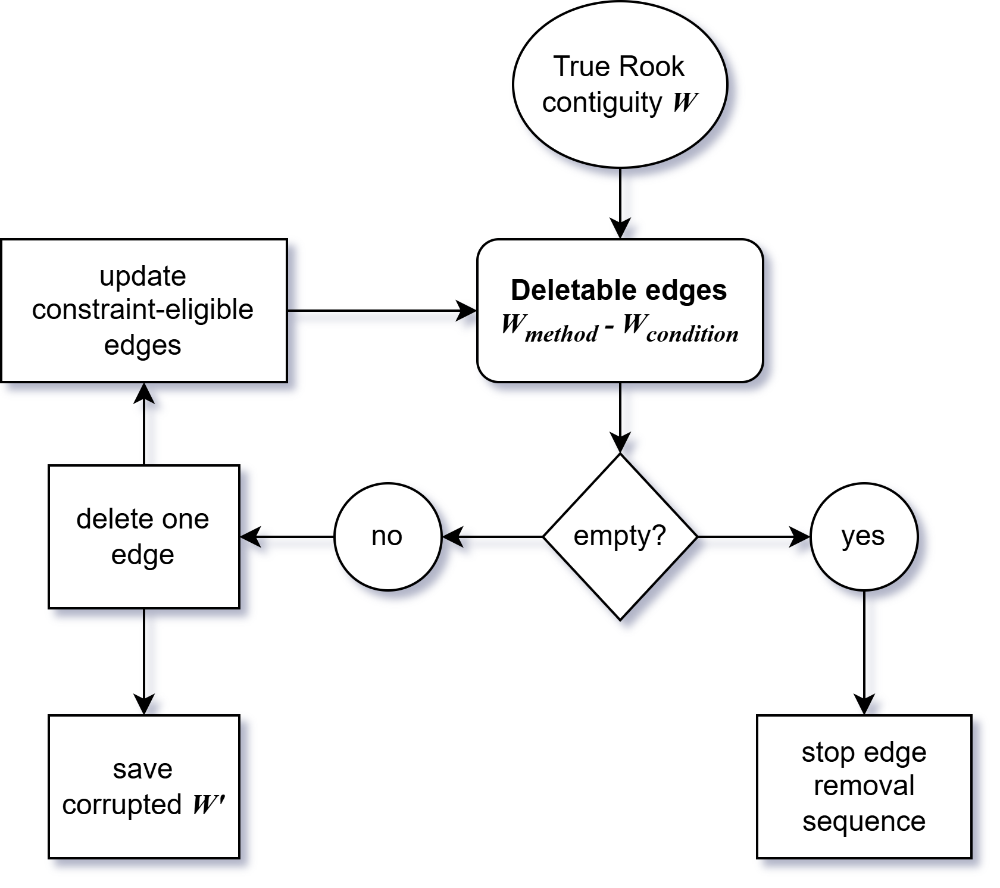{#fig-w_corruption fig-align="center" width="50%"}

#### Regionalization

Regionalization algorithms require $W$ to consist of a single connected component. Edges whose removal would disconnect $W$, referred to as bridges, are condition-breaking, thereby they need to be subtracted from the method-eligible edges, analogically to the no isolates condition discussed above. The one component condition is stricter, keeping more more edges in $W'$, hence the maximally corrupted graph under this condition has more edges than under one isolates condition for the same lattice as shown in fig.

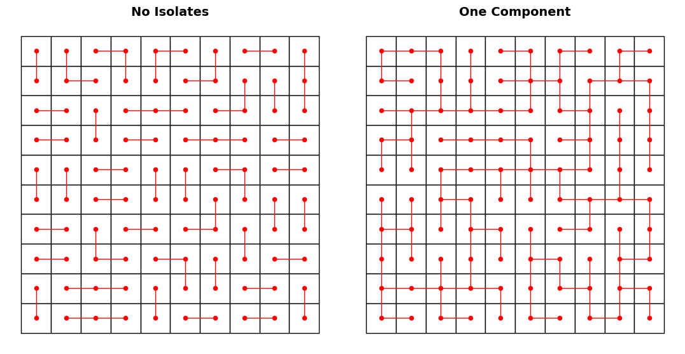{#fig-g_conditions fig-align="center" width="66%"}

### Final simulation {#sec-eval}

#### Spatial autocorrelation

For the primary analysis, 19 corrupted graphs were selected from each deletion sequence, spaced as evenly as the sequence length allows and always including both endpoints (the true graph and the maximally corrupted graph), giving 20 graphs per sequence including the true $W$. Some secondary analyses used different selections of corrupted graphs; these are specified where relevant in the Results.

After generating the attribute data and the corrupted graphs, Global Moran's $I$ (@eq-global_i) is computed using `esda.moran.Moran().I`, alongside its simulated $p$-value based on 999 permutations via `esda.moran.Moran().p_sim`. `esda.moran.Moran()` takes the attribute vector and the corresponding true $W$ or corrupted $W'$ as input.

Sensitivity is evaluated as the deviation of the corrupted estimate $I'$ from the true value $I$, that is $I' - I$, or its absolute value. The magnitude of the $p$-value itself is not evaluated directly; instead, each corrupted result is checked for whether it lost or gained statistical significance relative to the true result, using the significance threshold $\alpha = 0.05$.

#### Regionalization

Graphs were sampled using the same procedure described in the previous section on spatial autocorrelation and used for testing two regionalization methods: SCHC and SKATER (see @sec-schc and @sec-skater).

SCHC was implemented using `spopt.region.WardSpatial()`, which applies Ward's linkage, and SKATER using `spopt.region.Skater()`. The number of clusters was set to five for both algorithms, matching the number of predefined regions used to generate the synthetic data. Both functions return a set of labels assigning each observation to a region.

Ground truth for this comparison was not taken to be the original synthetic zonation itself, but rather the partition each algorithm produces when run on the true $W$ with a given attribute dataset. That is, for each of the five attribute datasets generated per zonation, SCHC and SKATER were each run once on the true $W$, and their respective outputs served as the reference partitions against which the same algorithm's output on the corrupted matrices $W'$ was subsequently compared. Consequently, SCHC and SKATER can yield different reference partitions for identical input data, since neither algorithm is guaranteed to exactly recover the generating zonation even in the absence of corruption.

Agreement between the reference and corrupted-graph partitions was quantified using the Adjusted Rand Index (ARI) [@hubert1985], which compares two partitions while correcting for the agreement expected by chance:

$$
ARI = \frac{2(TP \cdot TN - FN \cdot FP)}{(TP+FN)(FN+TN) + (TP+FP)(FP+TN)}
$$ {#eq-ari}

where $TP$ is the number of observation pairs placed in the same cluster under both partitions, $TN$ the number placed in different clusters under both, and $FP$ and $FN$ the number of pairs on which the two partitions disagree, in either direction. The regionalization labels obtained under $W'$ were always compared against the corresponding algorithm's own reference partition, as defined above. ARI ranges from -0.5 to 1, where 1 means complete agreement (partitions are identical). Values below zero suggest that the resulting regionalization exhibits less agreement with the reference partitions than would be expected by pure chance.

## Real data {#sec-real}

For the real datasets, different data sources were used for the autocorrelation and regionalization experiments. These datasets primarily serve to verify the findings obtained from the synthetic data. The graph corruption procedure is identical to the one applied to the synthetic data, described in @sec-corruption. Attribute values were not simulated but correspond to genuine observed statistics.

### SAC {#sec-real_sac}

To assess the vulnerability of global Moran's $I$ on real data, three datasets of varying size, initial $I$, and cardinality were used (see \@tbl-real-sac-datasets). The Guerry and Sacramento datasets were imported from the `geodatasets` library [@geodatasets] and the elections dataset from `libpysal` @rey2022PySAL. The basic information is in table x and each of them is further described in this chapter.

+------------+----------+---------------+------------+----------------------------------+
| name       | size     | variable used | $I_{true}$ | average cardinality              |
+============+==========+===============+============+==================================+
| Guerry     | 85       | Donatns       | 0.35       | 4.94                             |
+------------+----------+---------------+------------+----------------------------------+
| Sacramento | 403      | HH_INC        | 0.56       | 5.28                             |
+------------+----------+---------------+------------+----------------------------------+
| Elections  | 3105     | pct_dem_12    | 0.62       | 5.63 (nejdou mi tagovat tabulky) |
+------------+----------+---------------+------------+----------------------------------+

The Guerry dataset, the smallest of the three, is a classical study mapping "moral statistics" across the departments of France in the 1830s. The variable selected for computing $I$ is "Donatns", representing charitable donations per capita [@anselin2020lisa] (see @fig-guerry_overview (a)). With $I_{true}=0.35$, "Donatns", is the least spatially autocorrelated of the three. Cardinalities of Guerry's $W$ are shown in @fig-guerry_overview (b).

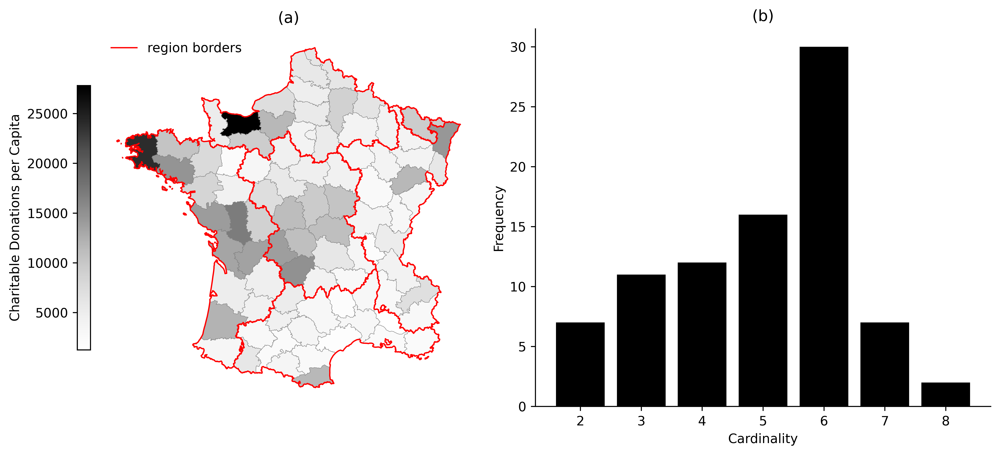{#fig-guerry_overview fig-align="center"}

Guerry's five-region "Region" column (@fig-guerry_overview (a)) parametrizes its region-border and local edge removal. Random and border removal were each run ten times, analogously to the synthetic protocol. Local removal, however, followed a different procedure from the one used on the synthetic lattices: each of the five regions was targeted twice, yielding ten sequences in total.

The Sacramento dataset represents 2000 employment and demographic statistics per census tract. The target variable is "HH_INC", representing median household income in 1999, visualized in @fig-sacramento_overview. The cardinality distribution of the Sacramento $W$ is shown in @fig-sacramento_overview (b).

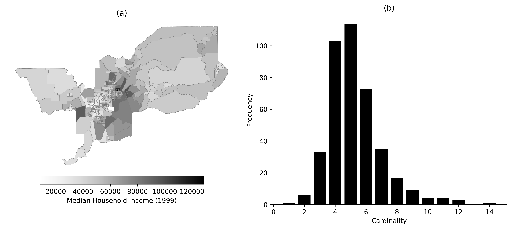{#fig-sacramento_overview}

The largest dataset, with over 3000 observations, is the Elections dataset, which shows the results of the 2012 and 2016 US presidential elections by county (continental United States, excluding Hawaii and Alaska). The chosen variable is "pct_dem_12", representing the Democratic vote share in 2012 (@fig-usa_overview (a)). Norfolk County (MA), Franklin County (OH), and Hancock County (WV) are islands and do not neighbour any other county; these were removed from the dataset prior to constructing $W$, leaving $n = 3105$.

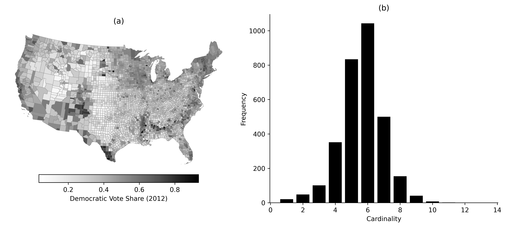{#fig-usa_overview fig-align="center"}

### Regionalization

Regionalization expereiment was also performed on 3 reaal datastes: Chicago, Ceara Zika and South, all imported trough geodatasets.

+------------+--------+-----------------------------------------------------------------------------------------------------+---------------------+
| name       | size   | variables                                                                                           | average cardinality |
+============+========+=====================================================================================================+=====================+
| Chicago    | 77     | poverty, crowded, dependency, without_hs, unemployed, income_pc, harship_in, perc_crime, perc_theft | 4.65                |
+------------+--------+-----------------------------------------------------------------------------------------------------+---------------------+
| Ceara Zika | 184    | mobility, environ, housing, sanitation, infra                                                       | 5.09                |
+------------+--------+-----------------------------------------------------------------------------------------------------+---------------------+
| South      | 1412   | HR90, UE90, DV90, FP89, BLK90                                                                       | 5.45                |
+------------+--------+-----------------------------------------------------------------------------------------------------+---------------------+

: Real datasets used for regionalization {#tbl-reg_datasets}

The Chicago dataset is frequently used as a showcase example in spatial data analysis, combining Airbnb listings with socioeconomic and crime statistics by community area. Nine variables were selected for the analysis, listed in @tbl-real-reg-datasets.

The Ceará Zika dataset maps Zika and microcephaly infections alongside socioeconomic variables across municipalities in the state of Ceará, Brazil. The five selected variables are listed in \@tbl-real-reg-datasets.

The South dataset contains homicide statistics and socioeconomic characteristics for counties in the southern United States. The five selected variables are listed in \@tbl-real-reg-datasets. The South dataset's region-border and local corruption were parametrized using its "STATE_FIPS" column. For local removal, each of the 17 states was selected once per sequence.

-tady by asi mely byt mapicky vsech(?) varibles

# Results

## Spatial autocorrelation

### Synthetic data

#### Moran's I

The kernel density plot (@fig-kdeplot) shows that deviations from the true Moran's I are symmetric around zero across all three ranges of true $I$, with roughly equal numbers of positive and negative deviations. Since deviations aren't systematically biased in one direction, the sign carries no additional information. From this point on, we therefore work with the absolute deviation, without loss of relevant information.

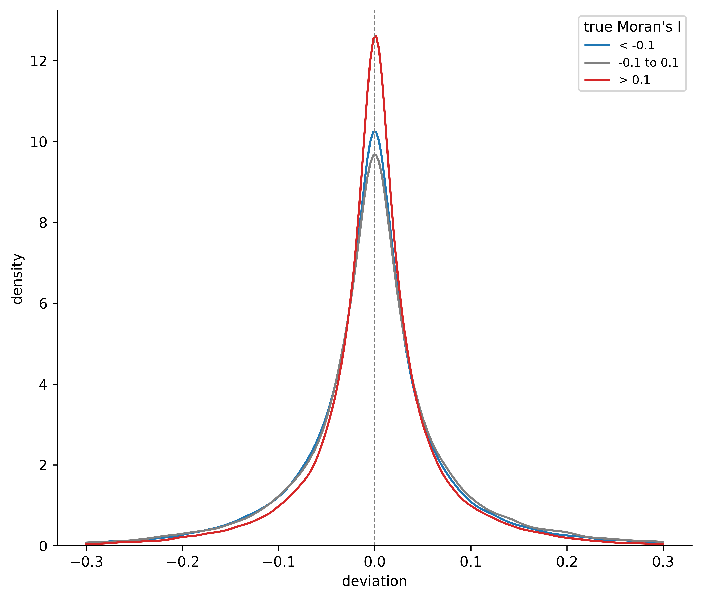{#fig-kdeplot fig-align="center" width="60%"}

Dataset size exerts the clearest influence on absolute deviation, with larger datasets demonstrating markably greater resilience to topology corruption (see @fig-shape_size_comapairson). For $n=400$, maximum deviation slightly exceeds 0.2, even under the most severe corruption levels examined (70-80% edges missing), whereas for $n=25$ it can reach up to 0.5 and even over 0.7 in the most extreme cases, which can critically mislead interpretation of the estimated spatial autocorrelation.

@fig-shape_size_comapairson also shows that lattice shape, which primarily distinguishes the average number of neighbors per node (cardinality), exerts a slight influence on the resulting deviations, where datasets with smaller cardinalities (square lattice) are more vulnerable, but compared to size, it does not affect it as much. Finally, across all lattice sizes, absolute deviation increases approximately linearly with the proportion of missing edges, with no distinct thresholds or stabilization points evident in the data.

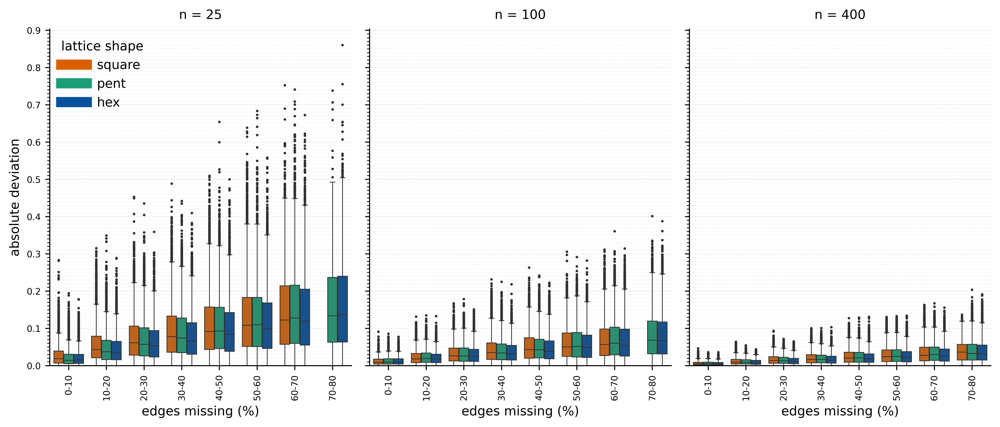{#fig-shape_size_comapairson fig-align="center"}

@fig-moran_vulnerability shows that random spatial patterns (true Moran's $I$ close to zero) are comparatively the most vulnerable to topology corruption, with maximum absolute deviations exceeding 0.3. As $I$ increases, estimates become increasingly robust. For positive autocorrelation, extreme absolute deviations do not exceed 0.2, and for values between 0.7 and 0.9 they remain below 0.1. Strongly negatively autocorrelated patterns were generated only for the square lattice, as it is only in this configuration that such extreme negative values could be sustained. Relative to their positive counterparts, these negative patterns exhibit somewhat larger deviations

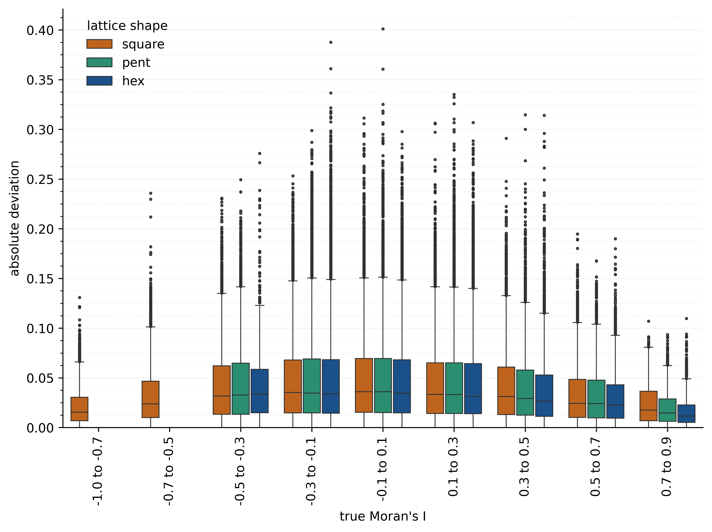{#fig-moran_vulnerability fig-align="center" width="80%"}

Across all bins, the 75th percentile does not exceed 0.07 absolute deviation, indicating that typical estimation error remains small even under substantial topology corruption. However, the occurrence of larger deviations in the upper tail indicates that isolated cases of substantial deviation remain possible and should not be dismissed when performing spatial autocorrelation analysis.

Results were also compared based on the removal method. Across all spatial structures, global Moran's I deviated the most under local edge removal, while border removal performed comparably to random edge removal at the same level of corruption. However, even the 95th percentile only slightly exceeds 0.1 in the most corrupted local-removal case (hexagonal lattice, $n = 100$) partly because the maximum percentage of removed edges is only 20–30% under this method. Nonetheless, absolute deviations of global Moran's $I$ remain small in absolute terms, suggesting the statistic is comparatively robust to targeted corruption even though local removal consistently produces the largest deviations among the three methods tested.

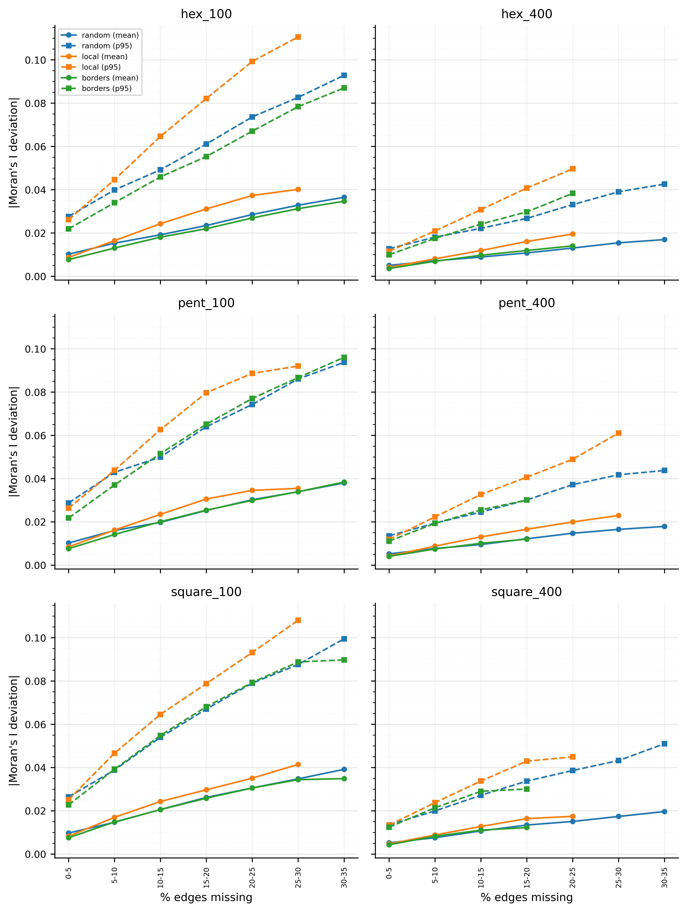{#fig-global_method_compairson fig-align="center"}

#### Statistical significance

@fig-p_scatter presents a scatterplot of true Moran's I values against their corrupted counterparts across different levels of graph corruption, demonstrated on hexagonal lattice of size 100. It confirms the symmetry of deviations observed in @fig-kdeplot and indicates that datasets exhibiting no significant spatial pattern are more vulnerable to misclassification.

@fig-p_scatter also illustrates how significance status changes relative to the critical value at $\alpha =0.05$. Specifically, it shows that whether a dataset is misclassified is not directly determined by the degree of corruption itself, but rather by whether the corrupted value crosses a critical threshold.

{#fig-p_scatter fig-align="center" width="100%"}

The false non-significance rate increases with corruption level, as illustrated in @fig-miss_sig (right), since more extensive edge removal raises the probability that a given estimate will cross the significance threshold. The magnitude of this rate also reflects dataset size: larger datasets are more stable, and therefore less vulnerable to misclassification. Interestingly, average cardinality does not correspond to greater robustness the way it does for $I$ values. Although $I$ deviates more strongly under corruption when cardinality is lower, lattices with lower average cardinality (e.g., square) show lower misclassification rates in @fig-miss_sig (right), while those with higher average cardinality (e.g., hexagonal) show higher rates.

The rate of false significance (@fig-miss_sig, left) is considerably lower than that of false non-significance. It increases up to approximately 15–20% missing edges across all lattice types and dataset sizes, after which it stabilizes and fluctuates around a rate of 8%, with no apparent influence from dataset size or cardinality.

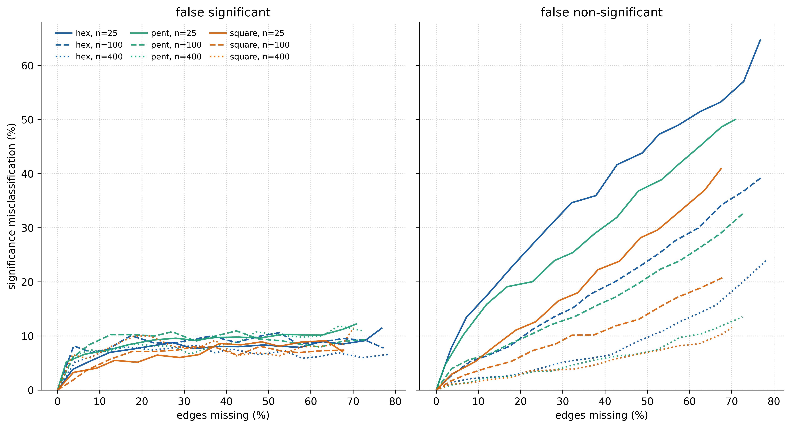{#fig-miss_sig fig-align="center" width="100%"}

The occurrence of significance loss and gain as a function of $I_{true}$ is illustrated in @fig-sig_hist. Significance loss increases as $I_{true}$ moves inward from extreme values toward the critical $I$ value, at which point the observation can no longer sustain significance. Significance gain, conversely, increases as $I_{true}$ moves outward from zero toward larger absolute values, culminating at approximately the same point at which significance loss culminates - the critical $I$ value. Datasets whose $I_{true}$ lies close to the critical value are therefore the most vulnerable to significance misinterpretation.

The width of the non-significance interval is primarily determined by sample size, with larger datasets narrowing this interval substantially. Connectivity exerts a similar but visibly weaker effect, with denser lattices yielding critical values closer to zero. The critical values can be estimated analytically from the moments of $I$ established by Cliff and Ord (1981) and will be examined in further detail in the Discussion.

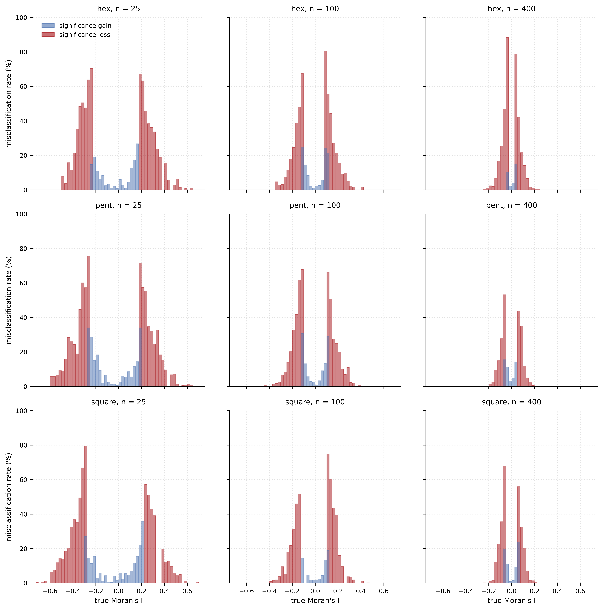{#fig-sig_hist fig-align="center"}

### Real data

The deviations of $I$ for real datasets shown in @fig-sac_real are consistent with the results obtained from synthetic data. The elections dataset exhibits strong robustness to corruption, with a maximum absolute deviation of 0.024 in the most corrupted case. This can be attributed both to a high positive $I_{true} = 0.62$ and to the dataset's large size ($n = 3108$). The Sacramento dataset shows greater vulnerability than the elections dataset: despite a similar true spatial autocorrelation ($I_{true} = 0.56$), this dataset is nearly eight times smaller ($n = 403$) , which is the primary driver of its increased vulnerability. However, the maximum deviation reaches only +0.11, which, given the magnitude of $I_{true}$, does not lead to a misleading conclusion.

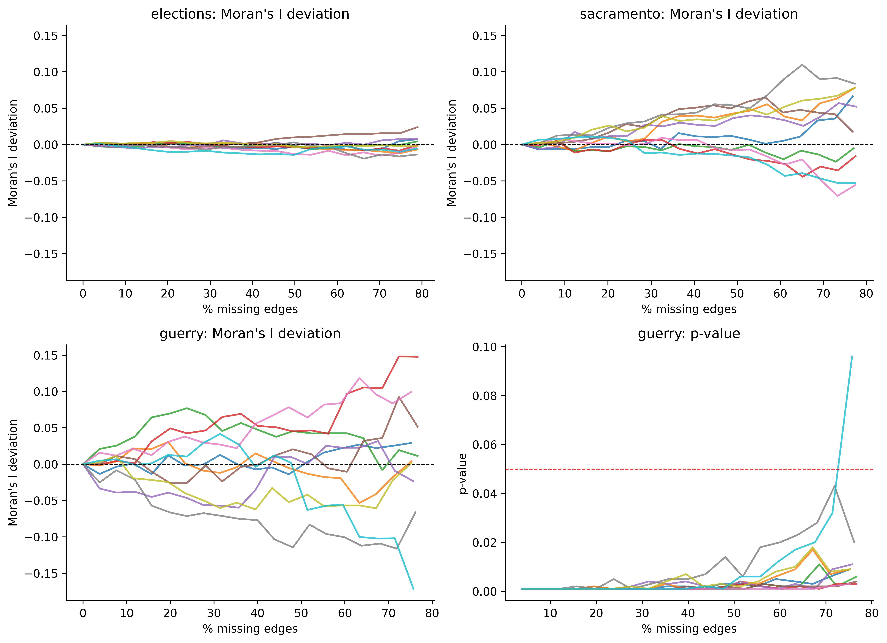{#fig-sac_real fig-align="center" width="100%"}

The Guerry dataset, with a relatively small $n = 85$ and weaker true positive spatial autocorrelation ($I_{true} = 0.35$), is considerably more fragile. In the most corrupted case, $I_{corrupt} = 0.18$, a deviation large enough to produce misleading conclusions about the underlying data. This is also the only case in which significance was lost at $\alpha = 0.05$, visualized in @fig-sac_real by the light blue line, alongside several other runs (grey, yellow, and orange lines) in which $I$ moves toward zero and approaches the significance threshold. This illustrates how a shift of $I$ toward zero can result in significance loss.

Across all real datasets, most notably for Sacramento and Guerry, @fig-sac_real shows that within the independent runs, the deviation does not grow linearly with the proportion of missing edges. Instead, it fluctuates: each run follows a distinct trajectory and in some cases additional missing edges partially cancel out prior deviation, causing the deviation to decrease even as corruption increases. This indicates that the resulting deviation is not solely a function of the amount of missing edges, but also depends on which specific edges are removed.

@fig-menhod_comparson_guerry shows that border removal sustained global Moran's I the best, with the 95th percentile not exceeding an absolute deviation of 0.025. In @fig-guerry_detail, we can see the independent runs converge onto two specific values, meaning that under maximum corruption, only two distinct graphs were generated.

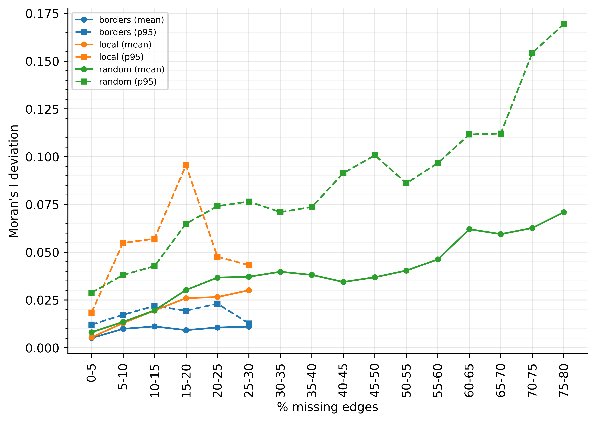{#fig-menhod_comparson_guerry fig-align="center" width="66%"}

Unlike the results for synthetic data, the mean deviation of *I* for the Guerry dataset under local removal does not show greater vulnerability than under random removal. However, at the same level of corruption as random removal, it does produce higher extreme values. This is shown in @fig-guerry_detail (deviation shown after removal edge by edge), where corruption of the West region (W) is responsible for the extreme case, reaching a deviation of approximately 0.1 after deleting 17% of edges, a level of deviation that random edge removal only reaches after deleting nearly 50% of edges.

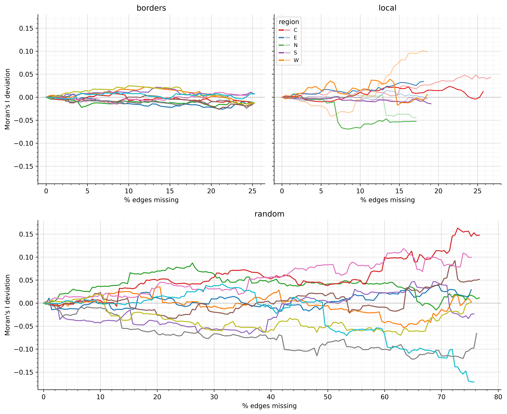{#fig-guerry_detail}

## Regionalization

### Synthetic data

Overall, SCHC shows greater robustness to graph corruption than SKATER. This is most visible in @fig-reg_boxplots for the hexagonal and pentagonal lattices of $n=400$, where SCHC's median ARI is noticeably higher across most of the corruption intensities. As more edges are removed, however, this gap narrows. At the highest levels of corruption the two methods converge, and in some configurations SKATER's median ARI slightly exceeds SCHC's.

SKATER's ARI distribution tends to be wider, with more extreme outliers, than SCHC's. This is most apparent for the pentagonal lattice with of $n=100$: even with minimal corruption (up to 5% edges missing), a subset of runs reach ARI values as low as approximately 0.35, and at the highest corruption level a number of runs return ARI values slightly below zero.

It is also worth noting the threshold beyond which perfect regionalization was no longer sustained, even in the best-case scenario. Both algorithms, across all lattice structures, were able to maintain a 100% correct partition up to approximately 15% missing edges; the square lattice of $n=100$ maintained this even up to 20%. Beyond this point, SKATER began producing slightly imperfect results (ARI around 0.95) between 15% and 20% missing edges, with the exception of the pentagonal lattice with $n=100$, where SCHC was the first to degrade instead. Under maximum corruption, the best-case ARI across configurations was approximately 0.7, with the exception of the square lattice with 100 units, which dropped below 0.6.

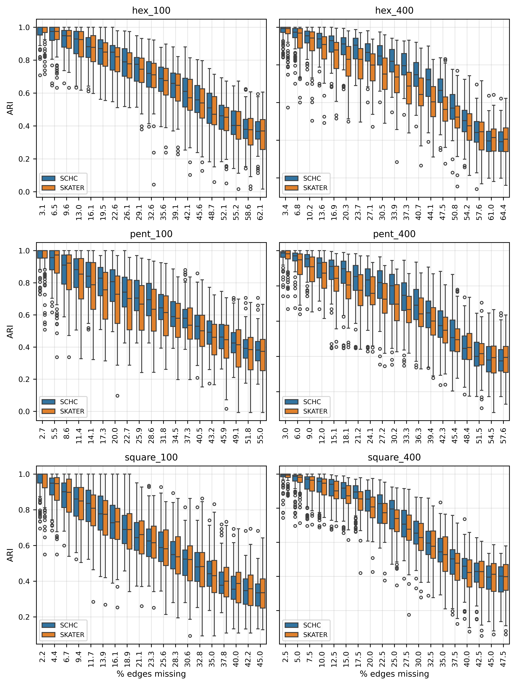{#fig-reg_boxplots fig-align="center"}

@fig-reg_line_plot offers a clearer comparison across the six spatial configurations for each method. The square lattice of $n=100$ performed worst overall, with one notable exception: under SKATER, it initially degraded more slowly than the other configurations, before dropping sharply below all other configurations as corruption continued. Under SKATER, both pentagonal lattices underperformed their hexagonal counterparts throughout the corruption range. Under SCHC, however, the pentagonal lattice with 400 units slightly outperformed the hexagonal lattice with 100 units up to roughly 40% missing edges. Across both methods, the rate of decline slows markedly toward the higher end of the corruption, minimum mean ARI across all six configurations and both methods falls within a narrow band of 0.33–0.39.

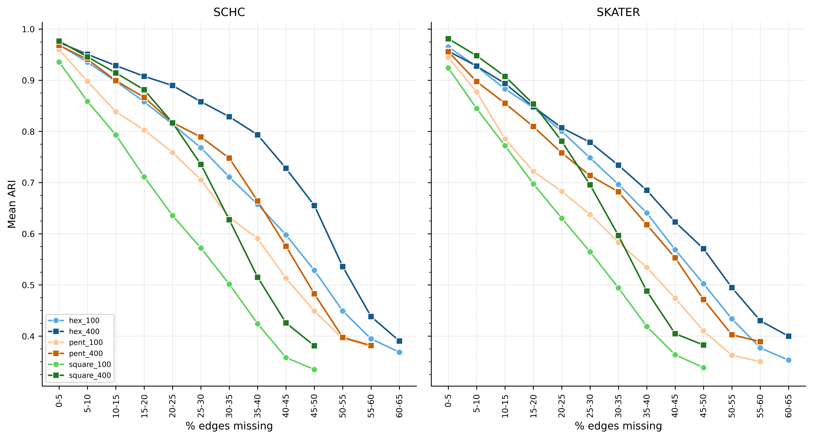{#fig-reg_line_plot fig-align="center"}

Compared with random edge removal, both targeted removal methods, border and local, resulted in substantially worse ARI degradation across all spatial layouts, for both algorithms. At low levels of corruption, the three removal methods perform similarly, with only small differences between them. As corruption increases, however, random removal degrades noticeably more slowly than either targeted method. For example, in the square lattice of $n=400$, both algorithms already drop to a mean ARI of around 0.4 by 15–20% missing edges under border removal, whereas random removal does not reach this level of degradation until approximately 45–50% missing edges, maintaining a mean ARI of roughly 0.85–0.9 at the same 15–20% missing level. Regionalization algorithms under local removal generally performed better or comparably to border removal at a given level of corruption.

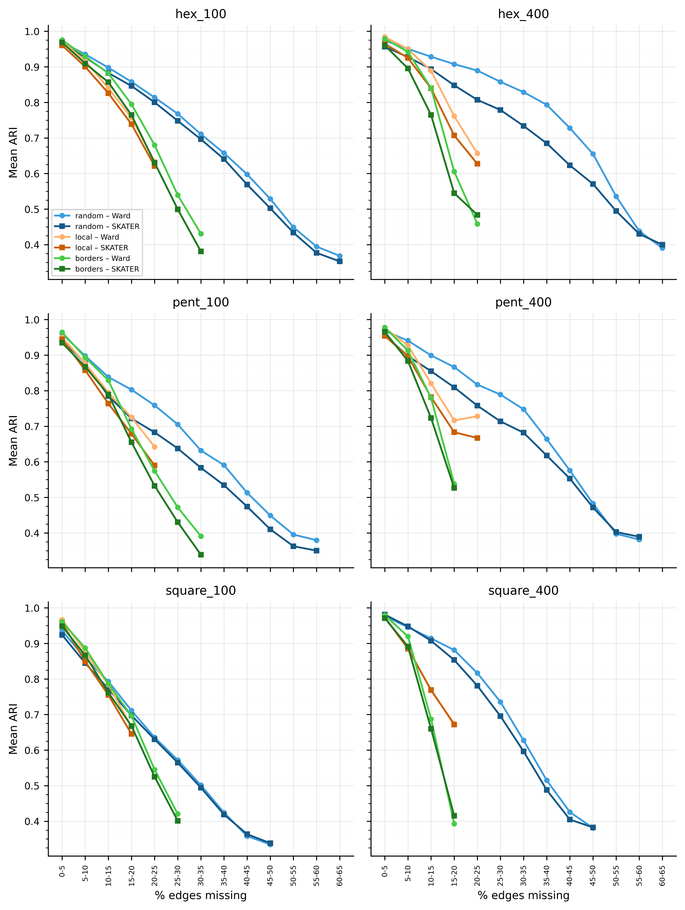{#fig-reg_nevim fig-align="center" width="100%"}

### Real data

Interestingly, the regionalization performed on real data does not follow the same degraadtion pattern as the synthetic data. SCHC, which performed better across all synthetic configurations, is here comparable to or worse than SKATER. This is most visible for the Ceará Zika dataset in @fig-reg_real_all, where SCHC's mean ARI drops rapidly to approximately 0.55 at 5–10% missing edges, and falls further to around 0.3 by 25% missing edges. A similar early drop appears for both algorithms in the South dataset, most notably for SCHC, whose mean ARI already falls to approximately 5% below its starting value within the first 5% of removed edges, in contrast to the synthetic data, which remained comparatively stable at low corruption levels.

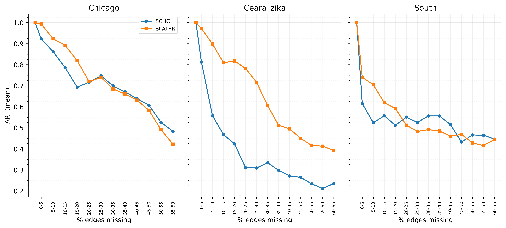{#fig-reg_real_all fig-align="center"}

To showcase the specific impact of per-edge removal, regionalization was performed on graphs with edges removed one by one, up to 50 missing edges. Specific runs were selected and plotted in @fig-reg_examples. The results show that degradation is not gradual, but instead occurs in discrete jumps: removing a single additional edge can shift the resulting ARI substantially. For example, removing just two edges from the Chicago dataset caused SCHC's ARI to fall sharply to 0.55. The resulting corrupted regionalization is shown in @fig-reg_chciago.

Another example is the Ceará Zika dataset, where SCHC regionalization ARI collapsed from a perfect score (ARI = 1) to 0.29 after the removal of 16 edges, producing a markedly different regionalization outcome (see @fig-reg_zika). Interestingly, as corruption continued, the regionalization recovered almost completely: after the removal of the 20th edge, ARI rose back up to 0.98.

SKATER regionalization for South shifted noticeably after the loss of only a single edge, with ARI dropping to 0.83, demonstrating that even a minor topological inconsistency can substantially alter the outcome of the statistic (see @fig-reg_south).

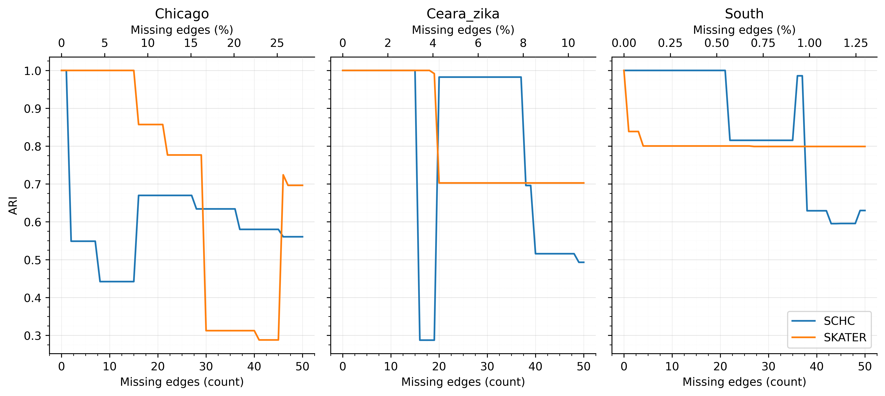{#fig-reg_examples fig-align="center"}

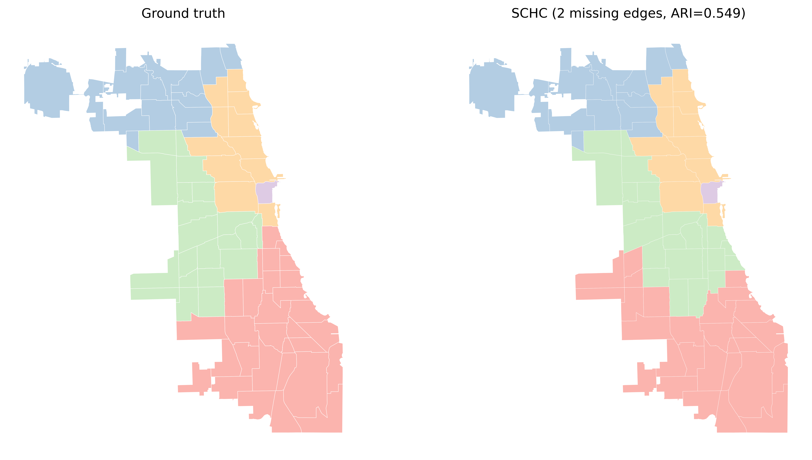{#fig-reg_chciago fig-align="center"}

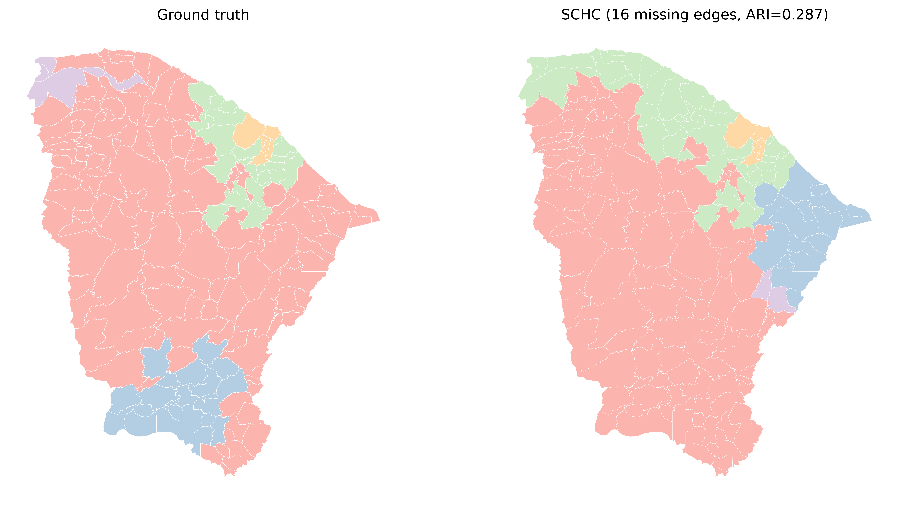{#fig-reg_zika}

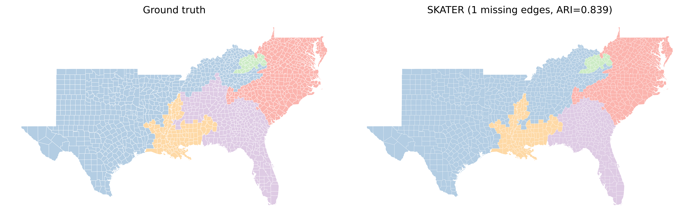{#fig-reg_south}

On the South dataset, edge removal methods were compared (see @fig-south_method) by computing the mean ARI within 1% wide bins. To ensure comparability across methods, the maximally corrupted graph under random edge removal was standardized to 500 missing edges, which corresponds to roughly 13 % missing edges . Borders removal yielded the poorest performance across both clustering algorithms, consistent with the results observed on the synthetic datasets. This pattern does not hold for local removal, however, which performs comparably to regionalization accuracy under random edge removal. The pronounced peak observed at the 9–10% interval is likely attributable to edge deletions concentrated within a specific region, where a greater number of edges were eligible for removal; this bin should therefore be interpreted with caution given its correspondingly small sample size.

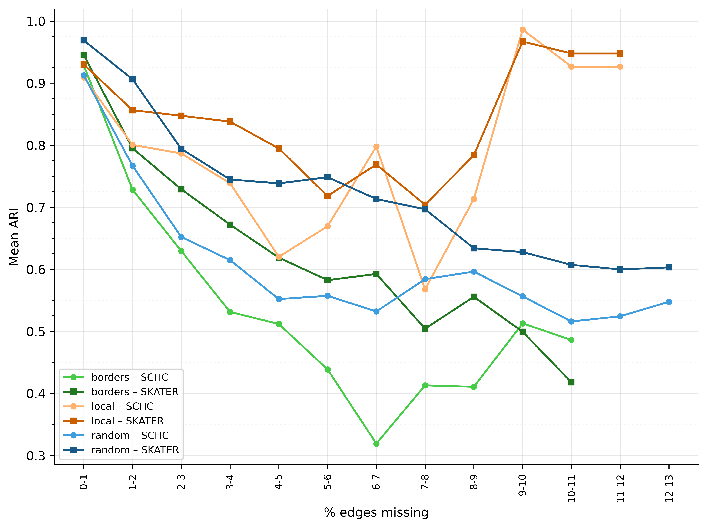{#fig-south_method fig-align="center" width="75%"}

# Discussion

-jak je mozny ze je deviation symetricka? pri densyfying to jde k nule, nemelo by to jit vic do extremu?

\- critical values a ten mechanismus, see below

The critical $I$ values that set the significance threshold can be estimated analytically using the moments derived by Cliff and Ord (1981), namely expected value $E[I]$ and variance $Var(I)$. Under the randomization assumption, the expectation and variance. Critically, $Var(I)$ depends on the structure of $W$, so the threshold is fully determined by $W$'s connectivity pattern together with one data-dependent scalar, curtosis $b_2$. The critical values follow directly by inverting the test statistic:

$$I_{crit} = E[I] \pm z_\alpha\sqrt{\text{Var}(I)}$$

As edges are removed, $I'_{crit}$ is pushed further from zero - sparser weight matrices produce a wider, harder-to-clear significance band <!--(Bivand, Müller, and Reder 2009; Cliff and Ord 1981)-->. This means graph corruption has two distinct effects: it perturbs the calculated $I'$ away from its true value, and it independently shifts the critical threshold itself.

Significance loss occurs when $|I| > |I_{crit}|$ and $|I'| < |I'_{crit}|$. As corruption increases, $|I'_{crit}|$ grows, causing a larger share of computed values $I'$ to fall within the widened non-significant interval. Notably, even where $I'$ moves away from zero, $I'_{crit}$ may still exceed it, since the threshold shifts independently of the realized value of $I'$.

This mechanism operates in the opposite direction for significance gain, which occurs when $|I| < |I_{crit}|$ and $|I'| > |I'_{crit}|$. If $I'$ moves toward zero under corruption, the observation necessarily remains non-significant. If $I'$ moves away from zero, it may in principle exceed the threshold; however, this outcome is comparatively rare, as $I'_{crit}$ is simultaneously shifting in the same direction. This asymmetry explains why significance gain occurs substantially less frequently than significance loss.

-na local removal citlivejsi asi protoze matrix heterogenenity a neco s tim S1, S2?

-porvnani real a synthtic dat, zduraznit, ze pravidelny lattices maji sva omezeni (nacaty v backgorundu)

-brutalni citlivost regionalizace, especially u real dat, je to hard to predict, a jelikoz jsou to oba greedy algoritmy, tak jakmile se to jednou posere, neni cesty zpet

-logicky asi se regionalizace posere, kdyz odebereme edge, ktera by v nejaky kroku mela nejvetsi/nejmensi distance mezi clustery a v pripade skateru mst

-efekt na regionalizaci je obyvlast understudied, jelikoz contiguty weights jsou jedina spravna volba

-morans i se meni relatively smoothly, ale regionalizace se odhaduje dost blbe.. kazdej odebranej edge s moranem neco udela, ale u regionalizace muze a nemusi,